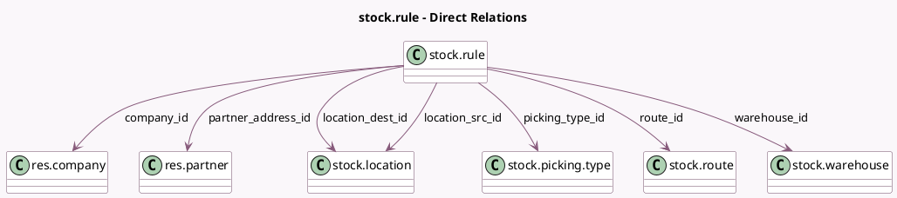

<!-- GENERATED:MODEL -->
---
tags: [odoo, community, generated, model]
---

# stock.rule

- Module: [[docs/Community Addons/stock/stock|stock]]
- Scope: Community Addons
- Defined in module: yes
- Source files: `models/stock_rule.py`
- Python classes: `StockRule`
- Description: Stock Rule

## Field footprint

- Detected fields: 22
- Field types: `Boolean` x 4, `Char` x 2, `Html` x 1, `Integer` x 3, `Json` x 1, `Many2one` x 8, `Selection` x 3
- Relation fields: 8

## Sample fields

- `action`: `Selection`
- `active`: `Boolean` (comodel `Active`)
- `auto`: `Selection`
- `company_id`: `Many2one` (comodel `res.company`)
- `delay`: `Integer` (comodel `Lead Time`)
- `location_dest_from_rule`: `Boolean` (comodel `Destination location origin from rule`)
- `location_dest_id`: `Many2one` (comodel `stock.location`)
- `location_src_id`: `Many2one` (comodel `stock.location`)
- `name`: `Char` (comodel `Name`)
- `partner_address_id`: `Many2one` (comodel `res.partner`)
- `picking_type_code_domain`: `Json` (compute `_compute_picking_type_code_domain`)
- `picking_type_id`: `Many2one` (comodel `stock.picking.type`)
- `procure_method`: `Selection`
- `propagate_cancel`: `Boolean` (comodel `Cancel Next Move`)
- `propagate_carrier`: `Boolean` (comodel `Propagation of carrier`)
- `push_domain`: `Char` (comodel `Push Applicability`)
- `route_company_id`: `Many2one` (related `route_id.company_id`)
- `route_id`: `Many2one` (comodel `stock.route`)
- `route_sequence`: `Integer` (comodel `Route Sequence`, related `route_id.sequence`, store `True`)
- `rule_message`: `Html` (compute `_compute_action_message`)

## Method hints

- Detected methods: 31
- Action methods: none
- Compute methods: `_compute_action_message`, `_compute_picking_type_code_domain`
- Onchange methods: `_onchange_picking_type`, `_onchange_route`

## Direct relation diagram

## Navigation

- **Parent:** [[docs/Community Addons/stock/Models]]

<!-- GENERATED:MODEL -->
