<!-- GENERATED:MODEL -->
---
tags: [odoo, community, generated, model]
---

# stock.rules.report

- Module: [[docs/Community Addons/stock/stock|stock]]
- Scope: Community Addons
- Defined in module: yes
- Source files: `wizard/stock_rules_report.py`
- Python classes: `StockRulesReport`
- Description: Stock Rules report

## Field footprint

- Detected fields: 4
- Field types: `Boolean` x 1, `Many2many` x 1, `Many2one` x 2
- Relation fields: 3

## Sample fields

- `product_has_variants`: `Boolean` (comodel `Has variants`)
- `product_id`: `Many2one` (comodel `product.product`)
- `product_tmpl_id`: `Many2one` (comodel `product.template`)
- `warehouse_ids`: `Many2many` (comodel `stock.warehouse`)

## Method hints

- Detected methods: 3
- Action methods: none
- Compute methods: none
- Onchange methods: none

## Direct relation diagram

```plantuml
@startuml
!define ODOO_COLOR_PRIMARY #714B67
!define ODOO_COLOR_ACCENT #875A7B
!define ODOO_COLOR_BG #FAF7FA

skinparam backgroundColor ODOO_COLOR_BG
skinparam defaultTextAlignment left
skinparam ArrowColor ODOO_COLOR_ACCENT
skinparam ClassBackgroundColor white
skinparam ClassBorderColor ODOO_COLOR_PRIMARY
skinparam ComponentBackgroundColor white
skinparam ComponentBorderColor ODOO_COLOR_PRIMARY
skinparam NoteBackgroundColor #FFF8FF
skinparam NoteBorderColor ODOO_COLOR_ACCENT
skinparam SequenceLifeLineBorderColor ODOO_COLOR_ACCENT
skinparam SequenceLifeLineBackgroundColor #FFFFFF
skinparam SequenceParticipantBorderColor ODOO_COLOR_PRIMARY
skinparam SequenceParticipantBackgroundColor #FFFFFF
skinparam sequence {
  ArrowColor ODOO_COLOR_ACCENT
  ActorBorderColor ODOO_COLOR_PRIMARY
}
title stock.rules.report - Direct Relations
class "stock.rules.report" as stock_rules_report
class "product.product" as product_product
class "product.template" as product_template
class "stock.warehouse" as stock_warehouse
stock_rules_report --> product_product : product_id
stock_rules_report --> product_template : product_tmpl_id
stock_rules_report .. stock_warehouse : warehouse_ids
@enduml
```

## Navigation

- **Parent:** [[docs/Community Addons/stock/Models]]

<!-- GENERATED:MODEL -->
