<!-- GENERATED:MODEL -->
---
tags: [odoo, community, generated, model]
---

# stock.scrap

- Module: [[docs/Community Addons/stock/stock|stock]]
- Scope: Community Addons
- Defined in module: yes
- Source files: `models/stock_scrap.py`
- Python classes: `StockScrap`
- Description: Scrap
- Inherits: `mail.thread`

## Field footprint

- Detected fields: 19
- Field types: `Boolean` x 1, `Char` x 2, `Datetime` x 1, `Float` x 1, `Many2many` x 2, `Many2one` x 9, `One2many` x 1, `Selection` x 2
- Relation fields: 12

## Sample fields

- `allowed_uom_ids`: `Many2many` (comodel `uom.uom`, compute `_compute_allowed_uom_ids`)
- `company_id`: `Many2one` (comodel `res.company`)
- `date_done`: `Datetime` (comodel `Date`)
- `location_id`: `Many2one` (comodel `stock.location`, compute `_compute_location_id`, store `True`)
- `lot_id`: `Many2one` (comodel `stock.lot`)
- `move_ids`: `One2many` (comodel `stock.move`)
- `name`: `Char` (comodel `Reference`)
- `origin`: `Char`
- `owner_id`: `Many2one` (comodel `res.partner`)
- `package_id`: `Many2one` (comodel `stock.package`)
- `picking_id`: `Many2one` (comodel `stock.picking`)
- `product_id`: `Many2one` (comodel `product.product`)
- `product_uom_id`: `Many2one` (comodel `uom.uom`, compute `_compute_product_uom_id`, store `True`)
- `scrap_location_id`: `Many2one` (comodel `stock.location`, compute `_compute_scrap_location_id`, store `True`)
- `scrap_qty`: `Float` (comodel `Quantity`, compute `_compute_scrap_qty`, store `True`)
- `scrap_reason_tag_ids`: `Many2many` (comodel `stock.scrap.reason.tag`)
- `should_replenish`: `Boolean`
- `state`: `Selection`
- `tracking`: `Selection` (related `product_id.tracking`)

## Method hints

- Detected methods: 15
- Action methods: `action_get_stock_move_lines`, `action_get_stock_picking`, `action_validate`
- Compute methods: `_compute_allowed_uom_ids`, `_compute_location_id`, `_compute_product_uom_id`, `_compute_scrap_location_id`, `_compute_scrap_qty`
- Onchange methods: `_onchange_serial_number`

## Direct relation diagram

```plantuml
@startuml
!define ODOO_COLOR_PRIMARY #714B67
!define ODOO_COLOR_ACCENT #875A7B
!define ODOO_COLOR_BG #FAF7FA

skinparam backgroundColor ODOO_COLOR_BG
skinparam defaultTextAlignment left
skinparam ArrowColor ODOO_COLOR_ACCENT
skinparam ClassBackgroundColor white
skinparam ClassBorderColor ODOO_COLOR_PRIMARY
skinparam ComponentBackgroundColor white
skinparam ComponentBorderColor ODOO_COLOR_PRIMARY
skinparam NoteBackgroundColor #FFF8FF
skinparam NoteBorderColor ODOO_COLOR_ACCENT
skinparam SequenceLifeLineBorderColor ODOO_COLOR_ACCENT
skinparam SequenceLifeLineBackgroundColor #FFFFFF
skinparam SequenceParticipantBorderColor ODOO_COLOR_PRIMARY
skinparam SequenceParticipantBackgroundColor #FFFFFF
skinparam sequence {
  ArrowColor ODOO_COLOR_ACCENT
  ActorBorderColor ODOO_COLOR_PRIMARY
}
title stock.scrap - Direct Relations
class "stock.scrap" as stock_scrap
class "product.product" as product_product
class "res.company" as res_company
class "res.partner" as res_partner
class "stock.location" as stock_location
class "stock.lot" as stock_lot
class "stock.move" as stock_move
class "stock.package" as stock_package
class "stock.picking" as stock_picking
class "stock.scrap.reason.tag" as stock_scrap_reason_tag
class "uom.uom" as uom_uom
stock_scrap --> res_company : company_id
stock_scrap --> product_product : product_id
stock_scrap .. uom_uom : allowed_uom_ids
stock_scrap --> uom_uom : product_uom_id
stock_scrap --> stock_lot : lot_id
stock_scrap --> stock_package : package_id
stock_scrap --> res_partner : owner_id
stock_scrap --|> stock_move : move_ids
stock_scrap --> stock_picking : picking_id
stock_scrap --> stock_location : location_id
stock_scrap --> stock_location : scrap_location_id
stock_scrap .. stock_scrap_reason_tag : scrap_reason_tag_ids
@enduml
```

## Navigation

- **Parent:** [[docs/Community Addons/stock/Models]]

<!-- GENERATED:MODEL -->
