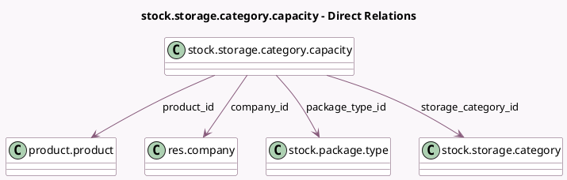

<!-- GENERATED:MODEL -->
---
tags: [odoo, community, generated, model]
---

# stock.storage.category.capacity

- Module: [[docs/Community Addons/stock/stock|stock]]
- Scope: Community Addons
- Defined in module: yes
- Source files: `models/stock_storage_category.py`
- Python classes: `StockStorageCategoryCapacity`
- Description: Storage Category Capacity

## Field footprint

- Detected fields: 6
- Field types: `Float` x 1, `Many2one` x 5
- Relation fields: 5

## Sample fields

- `company_id`: `Many2one` (comodel `res.company`, related `storage_category_id.company_id`)
- `package_type_id`: `Many2one` (comodel `stock.package.type`)
- `product_id`: `Many2one` (comodel `product.product`)
- `product_uom_id`: `Many2one` (related `product_id.uom_id`)
- `quantity`: `Float` (comodel `Quantity`)
- `storage_category_id`: `Many2one` (comodel `stock.storage.category`)

## Method hints

- Detected methods: 0
- Action methods: none
- Compute methods: none
- Onchange methods: none

## Direct relation diagram

## Navigation

- **Parent:** [[docs/Community Addons/stock/Models]]

<!-- GENERATED:MODEL -->
