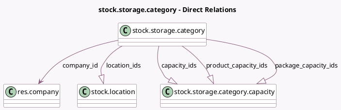

<!-- GENERATED:MODEL -->
---
tags: [odoo, community, generated, model]
---

# stock.storage.category

- Module: [[docs/Community Addons/stock/stock|stock]]
- Scope: Community Addons
- Defined in module: yes
- Source files: `models/stock_storage_category.py`
- Python classes: `StockStorageCategory`
- Description: Storage Category

## Field footprint

- Detected fields: 9
- Field types: `Char` x 2, `Float` x 1, `Many2one` x 1, `One2many` x 4, `Selection` x 1
- Relation fields: 5

## Sample fields

- `allow_new_product`: `Selection`
- `capacity_ids`: `One2many` (comodel `stock.storage.category.capacity`)
- `company_id`: `Many2one` (comodel `res.company`)
- `location_ids`: `One2many` (comodel `stock.location`)
- `max_weight`: `Float` (comodel `Max Weight`)
- `name`: `Char` (comodel `Storage Category`)
- `package_capacity_ids`: `One2many` (comodel `stock.storage.category.capacity`, compute `_compute_storage_capacity_ids`)
- `product_capacity_ids`: `One2many` (comodel `stock.storage.category.capacity`, compute `_compute_storage_capacity_ids`)
- `weight_uom_name`: `Char` (compute `_compute_weight_uom_name`)

## Method hints

- Detected methods: 4
- Action methods: none
- Compute methods: `_compute_storage_capacity_ids`, `_compute_weight_uom_name`
- Onchange methods: none

## Direct relation diagram

## Navigation

- **Parent:** [[docs/Community Addons/stock/Models]]

<!-- GENERATED:MODEL -->
