<!-- GENERATED:MODEL -->
---
tags: [odoo, community, generated, model]
---

# stock.warehouse

- Module: [[docs/Community Addons/stock/stock|stock]]
- Scope: Community Addons
- Defined in module: yes
- Source files: `models/stock_warehouse.py`
- Python classes: `StockWarehouse`
- Description: Warehouse

## Field footprint

- Detected fields: 28
- Field types: `Boolean` x 1, `Char` x 2, `Integer` x 1, `Many2many` x 2, `Many2one` x 19, `One2many` x 1, `Selection` x 2
- Relation fields: 22

## Sample fields

- `active`: `Boolean` (comodel `Active`)
- `code`: `Char` (comodel `Short Name`)
- `company_id`: `Many2one` (comodel `res.company`)
- `delivery_route_id`: `Many2one` (comodel `stock.route`)
- `delivery_steps`: `Selection`
- `in_type_id`: `Many2one` (comodel `stock.picking.type`)
- `int_type_id`: `Many2one` (comodel `stock.picking.type`)
- `lot_stock_id`: `Many2one` (comodel `stock.location`)
- `mto_pull_id`: `Many2one` (comodel `stock.rule`)
- `name`: `Char` (comodel `Warehouse`)
- `out_type_id`: `Many2one` (comodel `stock.picking.type`)
- `pack_type_id`: `Many2one` (comodel `stock.picking.type`)
- `partner_id`: `Many2one` (comodel `res.partner`)
- `pick_type_id`: `Many2one` (comodel `stock.picking.type`)
- `qc_type_id`: `Many2one` (comodel `stock.picking.type`)
- `reception_route_id`: `Many2one` (comodel `stock.route`)
- `reception_steps`: `Selection`
- `resupply_route_ids`: `One2many` (comodel `stock.route`)
- `resupply_wh_ids`: `Many2many` (comodel `stock.warehouse`)
- `route_ids`: `Many2many` (comodel `stock.route`)

## Method hints

- Detected methods: 44
- Action methods: `action_view_all_routes`
- Compute methods: none
- Onchange methods: `_onchange_company_id`

## Direct relation diagram

```plantuml
@startuml
!define ODOO_COLOR_PRIMARY #714B67
!define ODOO_COLOR_ACCENT #875A7B
!define ODOO_COLOR_BG #FAF7FA

skinparam backgroundColor ODOO_COLOR_BG
skinparam defaultTextAlignment left
skinparam ArrowColor ODOO_COLOR_ACCENT
skinparam ClassBackgroundColor white
skinparam ClassBorderColor ODOO_COLOR_PRIMARY
skinparam ComponentBackgroundColor white
skinparam ComponentBorderColor ODOO_COLOR_PRIMARY
skinparam NoteBackgroundColor #FFF8FF
skinparam NoteBorderColor ODOO_COLOR_ACCENT
skinparam SequenceLifeLineBorderColor ODOO_COLOR_ACCENT
skinparam SequenceLifeLineBackgroundColor #FFFFFF
skinparam SequenceParticipantBorderColor ODOO_COLOR_PRIMARY
skinparam SequenceParticipantBackgroundColor #FFFFFF
skinparam sequence {
  ArrowColor ODOO_COLOR_ACCENT
  ActorBorderColor ODOO_COLOR_PRIMARY
}
title stock.warehouse - Direct Relations
class "stock.warehouse" as stock_warehouse
class "res.company" as res_company
class "res.partner" as res_partner
class "stock.location" as stock_location
class "stock.picking.type" as stock_picking_type
class "stock.route" as stock_route
class "stock.rule" as stock_rule
class "stock.warehouse" as stock_warehouse
stock_warehouse --> res_company : company_id
stock_warehouse --> res_partner : partner_id
stock_warehouse --> stock_location : view_location_id
stock_warehouse --> stock_location : lot_stock_id
stock_warehouse .. stock_route : route_ids
stock_warehouse --> stock_location : wh_input_stock_loc_id
stock_warehouse --> stock_location : wh_qc_stock_loc_id
stock_warehouse --> stock_location : wh_output_stock_loc_id
stock_warehouse --> stock_location : wh_pack_stock_loc_id
stock_warehouse --> stock_rule : mto_pull_id
stock_warehouse --> stock_picking_type : pick_type_id
stock_warehouse --> stock_picking_type : pack_type_id
stock_warehouse --> stock_picking_type : out_type_id
stock_warehouse --> stock_picking_type : in_type_id
stock_warehouse --> stock_picking_type : int_type_id
stock_warehouse --> stock_picking_type : qc_type_id
stock_warehouse --> stock_picking_type : store_type_id
stock_warehouse --> stock_picking_type : xdock_type_id
@enduml
```

## Navigation

- **Parent:** [[docs/Community Addons/stock/Models]]

<!-- GENERATED:MODEL -->
