<!-- GENERATED:MODEL -->
---
tags: [odoo, community, generated, model]
---

# stock.warehouse.orderpoint

- Module: [[docs/Community Addons/stock/stock|stock]]
- Scope: Community Addons
- Defined in module: yes
- Source files: `models/stock_orderpoint.py`
- Python classes: `StockWarehouseOrderpoint`
- Description: Minimum Inventory Rule

## Field footprint

- Detected fields: 33
- Field types: `Boolean` x 3, `Char` x 4, `Date` x 3, `Float` x 9, `Many2many` x 2, `Many2one` x 10, `One2many` x 1, `Selection` x 1
- Relation fields: 13

## Sample fields

- `active`: `Boolean` (comodel `Active`)
- `allowed_location_ids`: `One2many` (comodel `stock.location`, compute `_compute_allowed_location_ids`)
- `allowed_replenishment_uom_ids`: `Many2many` (comodel `uom.uom`, compute `_compute_allowed_replenishment_uom_ids`)
- `company_id`: `Many2one` (comodel `res.company`)
- `days_to_order`: `Float` (compute `_compute_days_to_order`)
- `deadline_date`: `Date` (comodel `Deadline`, compute `_compute_deadline_date`, store `True`)
- `effective_route_id`: `Many2one` (comodel `stock.route`, compute `_compute_effective_route_id`, store `False`)
- `lead_days`: `Float` (compute `_compute_lead_days`)
- `lead_horizon_date`: `Date` (compute `_compute_lead_days`)
- `location_id`: `Many2one` (comodel `stock.location`, compute `_compute_location_id`, store `True`)
- `name`: `Char` (comodel `Name`)
- `product_category_id`: `Many2one` (comodel `product.category`, related `product_id.categ_id`)
- `product_id`: `Many2one` (comodel `product.product`)
- `product_max_qty`: `Float` (comodel `Max Quantity`, compute `_compute_product_max_qty`, store `True`)
- `product_min_qty`: `Float` (comodel `Min Quantity`)
- `product_tmpl_id`: `Many2one` (comodel `product.template`, related `product_id.product_tmpl_id`)
- `product_uom`: `Many2one` (comodel `uom.uom`, related `product_id.uom_id`)
- `product_uom_name`: `Char` (related `product_uom.display_name`)
- `qty_forecast`: `Float` (comodel `Forecast`, compute `_compute_qty`)
- `qty_on_hand`: `Float` (comodel `On Hand`, compute `_compute_qty`)

## Method hints

- Detected methods: 50
- Action methods: `action_open_orderpoints`, `action_product_forecast_report`, `action_remove_manual_qty_to_order`, `action_replenish`, `action_replenish_auto`, `action_stock_replenishment_info`
- Compute methods: `_compute_allowed_location_ids`, `_compute_allowed_replenishment_uom_ids`, `_compute_days_to_order`, `_compute_deadline_date`, `_compute_effective_route_id`, `_compute_lead_days`, `_compute_location_id`, `_compute_product_max_qty`, and 9 more
- Onchange methods: `_onchange_product_id`

## Direct relation diagram

```plantuml
@startuml
!define ODOO_COLOR_PRIMARY #714B67
!define ODOO_COLOR_ACCENT #875A7B
!define ODOO_COLOR_BG #FAF7FA

skinparam backgroundColor ODOO_COLOR_BG
skinparam defaultTextAlignment left
skinparam ArrowColor ODOO_COLOR_ACCENT
skinparam ClassBackgroundColor white
skinparam ClassBorderColor ODOO_COLOR_PRIMARY
skinparam ComponentBackgroundColor white
skinparam ComponentBorderColor ODOO_COLOR_PRIMARY
skinparam NoteBackgroundColor #FFF8FF
skinparam NoteBorderColor ODOO_COLOR_ACCENT
skinparam SequenceLifeLineBorderColor ODOO_COLOR_ACCENT
skinparam SequenceLifeLineBackgroundColor #FFFFFF
skinparam SequenceParticipantBorderColor ODOO_COLOR_PRIMARY
skinparam SequenceParticipantBackgroundColor #FFFFFF
skinparam sequence {
  ArrowColor ODOO_COLOR_ACCENT
  ActorBorderColor ODOO_COLOR_PRIMARY
}
title stock.warehouse.orderpoint - Direct Relations
class "stock.warehouse.orderpoint" as stock_warehouse_orderpoint
class "product.category" as product_category
class "product.product" as product_product
class "product.template" as product_template
class "res.company" as res_company
class "stock.location" as stock_location
class "stock.route" as stock_route
class "stock.rule" as stock_rule
class "stock.warehouse" as stock_warehouse
class "uom.uom" as uom_uom
stock_warehouse_orderpoint --> stock_warehouse : warehouse_id
stock_warehouse_orderpoint --> stock_location : location_id
stock_warehouse_orderpoint --> product_template : product_tmpl_id
stock_warehouse_orderpoint --> product_product : product_id
stock_warehouse_orderpoint --> product_category : product_category_id
stock_warehouse_orderpoint --> uom_uom : product_uom
stock_warehouse_orderpoint .. uom_uom : allowed_replenishment_uom_ids
stock_warehouse_orderpoint --> uom_uom : replenishment_uom_id
stock_warehouse_orderpoint --> res_company : company_id
stock_warehouse_orderpoint --|> stock_location : allowed_location_ids
stock_warehouse_orderpoint .. stock_rule : rule_ids
stock_warehouse_orderpoint --> stock_route : route_id
stock_warehouse_orderpoint --> stock_route : effective_route_id
@enduml
```

## Navigation

- **Parent:** [[docs/Community Addons/stock/Models]]

<!-- GENERATED:MODEL -->
