<!-- GENERATED:MODEL -->
---
tags: [odoo, community, generated, model]
---

# stock.warn.insufficient.qty

- Module: [[docs/Community Addons/stock/stock|stock]]
- Scope: Community Addons
- Defined in module: yes
- Source files: `wizard/stock_warn_insufficient_qty.py`
- Python classes: `StockWarnInsufficientQty`
- Description: Warn Insufficient Quantity

## Field footprint

- Detected fields: 5
- Field types: `Char` x 1, `Float` x 1, `Many2many` x 1, `Many2one` x 2
- Relation fields: 3

## Sample fields

- `location_id`: `Many2one` (comodel `stock.location`)
- `product_id`: `Many2one` (comodel `product.product`)
- `product_uom_name`: `Char` (comodel `Unit`)
- `quant_ids`: `Many2many` (comodel `stock.quant`, compute `_compute_quant_ids`)
- `quantity`: `Float`

## Method hints

- Detected methods: 3
- Action methods: `action_done`
- Compute methods: `_compute_quant_ids`
- Onchange methods: none

## Direct relation diagram

```plantuml
@startuml
!define ODOO_COLOR_PRIMARY #714B67
!define ODOO_COLOR_ACCENT #875A7B
!define ODOO_COLOR_BG #FAF7FA

skinparam backgroundColor ODOO_COLOR_BG
skinparam defaultTextAlignment left
skinparam ArrowColor ODOO_COLOR_ACCENT
skinparam ClassBackgroundColor white
skinparam ClassBorderColor ODOO_COLOR_PRIMARY
skinparam ComponentBackgroundColor white
skinparam ComponentBorderColor ODOO_COLOR_PRIMARY
skinparam NoteBackgroundColor #FFF8FF
skinparam NoteBorderColor ODOO_COLOR_ACCENT
skinparam SequenceLifeLineBorderColor ODOO_COLOR_ACCENT
skinparam SequenceLifeLineBackgroundColor #FFFFFF
skinparam SequenceParticipantBorderColor ODOO_COLOR_PRIMARY
skinparam SequenceParticipantBackgroundColor #FFFFFF
skinparam sequence {
  ArrowColor ODOO_COLOR_ACCENT
  ActorBorderColor ODOO_COLOR_PRIMARY
}
title stock.warn.insufficient.qty - Direct Relations
class "stock.warn.insufficient.qty" as stock_warn_insufficient_qty
class "product.product" as product_product
class "stock.location" as stock_location
class "stock.quant" as stock_quant
stock_warn_insufficient_qty --> product_product : product_id
stock_warn_insufficient_qty --> stock_location : location_id
stock_warn_insufficient_qty .. stock_quant : quant_ids
@enduml
```

## Navigation

- **Parent:** [[docs/Community Addons/stock/Models]]

<!-- GENERATED:MODEL -->
