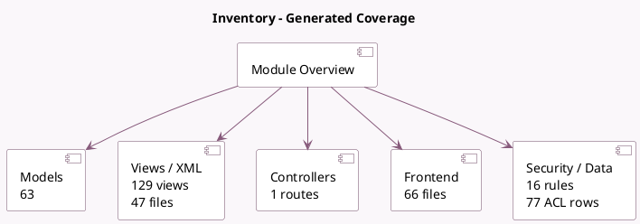

<!-- GENERATED:MODULE -->
---
tags: [odoo, community, module]
---

# Inventory

- Scope: Community Addons
- Source: odoo/addons/stock
- Dependencies: [[docs/Community Addons/product/product|product]], [[docs/Community Addons/barcodes_gs1_nomenclature/barcodes_gs1_nomenclature|barcodes_gs1_nomenclature]], [[docs/Community Addons/digest/digest|digest]]

## Summary

Manage your stock and logistics activities

## Generated coverage

- Models: 63
- XML files with UI/data artifacts: 47
- Views: 129
- Actions: 103
- Menus: 42
- Rules (ir.rule): 16
- Access CSV entries: 77
- Controller units: 1
- Frontend asset files: 66

## Module map

## Detail notes

- Models: [[docs/Community Addons/stock/Models|Models]] (63)
- Views and XML: [[docs/Community Addons/stock/Views|Views]] (47 files)
- Controllers: [[docs/Community Addons/stock/Controllers|Controllers]] (1)
- Frontend: [[docs/Community Addons/stock/Frontend|Frontend]] (66 files)

## Key models

- `barcode.rule`
- `ir.actions.report`
- `lot.label.layout`
- `picking.label.type`
- `product.catalog.mixin`
- `product.category`
- `product.label.layout`
- `product.product`
- `product.removal`
- `product.replenish`
- `product.template`
- `report.stock.label_lot_template_view`

## Navigation

- [[../Community Addons/Community Addons|Back to scope]]
- [[../../docs/docs|Back to docs]]

<!-- GENERATED:MODULE -->

## Curated analysis

### Functional role
- `stock` is the warehouse execution engine for Odoo: locations, moves, move lines, quants, pickings, routes, replenishment, lots, packages, and warehouses all converge here.
- Many downstream modules feel independent, but they usually inherit or orchestrate the state machine implemented by this addon.

### Operational footprint
- `stock_move.py`, `stock_picking.py`, and `stock_quant.py` form the operational backbone for reservations, transfers, validation, and on-hand stock visibility.
- The module has a very dense UI and security surface; `views/stock_picking_views.xml` and `security/stock_security.xml` are central when tracing permissions and operator flows.

### Evidence
- Source files: `odoo19/addons/stock/models/stock_move.py`, `odoo19/addons/stock/models/stock_picking.py`, `odoo19/addons/stock/models/stock_quant.py`
- UI and security: `odoo19/addons/stock/views/stock_picking_views.xml`, `odoo19/addons/stock/security/stock_security.xml`
- Tests: `odoo19/addons/stock/tests/test_move2.py`, `odoo19/addons/stock/tests/test_generate_serial_numbers.py`

### Related notes
- `[[docs/Core/Processes/Inventory/Inventory]]`
- `[[docs/Core/Master Data/product_product]]`

### Risks and follow-up
- Route, warehouse, and location configuration errors propagate fast because the same move network drives replenishment, picking, and valuation side effects.
- Serial and lot handling should be validated with the exact picking configuration in use because reservation behavior changes once traceability becomes mandatory.
- Legacy comparison backlog was retired on 2026-03-02; keep this note focused on the current codebase.

