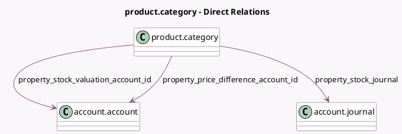

<!-- GENERATED:MODEL -->
---
tags: [odoo, community, generated, model]
---

# product.category

- Module: [[docs/Community Addons/stock_account/stock_account|stock_account]]
- Scope: Community Addons
- Defined in module: extension only
- Source files: `models/product.py`
- Python classes: `ProductCategory`

## Field footprint

- Detected fields: 6
- Field types: `Boolean` x 1, `Many2one` x 3, `Selection` x 2
- Relation fields: 3

## Sample fields

- `anglo_saxon_accounting`: `Boolean` (compute `_compute_anglo_saxon_accounting`)
- `property_cost_method`: `Selection`
- `property_price_difference_account_id`: `Many2one` (comodel `account.account`)
- `property_stock_journal`: `Many2one` (comodel `account.journal`)
- `property_stock_valuation_account_id`: `Many2one` (comodel `account.account`)
- `property_valuation`: `Selection`

## Method hints

- Detected methods: 1
- Action methods: none
- Compute methods: `_compute_anglo_saxon_accounting`
- Onchange methods: none

## Direct relation diagram

## Navigation

- **Parent:** [[docs/Community Addons/stock_account/Models]]

<!-- GENERATED:MODEL -->
