<!-- GENERATED:MODEL -->
---
tags: [odoo, community, generated, model]
---

# product.product

- Module: [[docs/Community Addons/stock_account/stock_account|stock_account]]
- Scope: Community Addons
- Defined in module: extension only
- Source files: `models/product.py`
- Python classes: `ProductProduct`

## Field footprint

- Detected fields: 3
- Field types: `Many2one` x 1, `Monetary` x 2
- Relation fields: 1

## Sample fields

- `avg_cost`: `Monetary` (compute `_compute_value`)
- `company_currency_id`: `Many2one` (comodel `res.currency`, compute `_compute_value`)
- `total_value`: `Monetary` (compute `_compute_value`)

## Method hints

- Detected methods: 9
- Action methods: none
- Compute methods: `_compute_value`
- Onchange methods: none

## Direct relation diagram

```plantuml
@startuml
!define ODOO_COLOR_PRIMARY #714B67
!define ODOO_COLOR_ACCENT #875A7B
!define ODOO_COLOR_BG #FAF7FA

skinparam backgroundColor ODOO_COLOR_BG
skinparam defaultTextAlignment left
skinparam ArrowColor ODOO_COLOR_ACCENT
skinparam ClassBackgroundColor white
skinparam ClassBorderColor ODOO_COLOR_PRIMARY
skinparam ComponentBackgroundColor white
skinparam ComponentBorderColor ODOO_COLOR_PRIMARY
skinparam NoteBackgroundColor #FFF8FF
skinparam NoteBorderColor ODOO_COLOR_ACCENT
skinparam SequenceLifeLineBorderColor ODOO_COLOR_ACCENT
skinparam SequenceLifeLineBackgroundColor #FFFFFF
skinparam SequenceParticipantBorderColor ODOO_COLOR_PRIMARY
skinparam SequenceParticipantBackgroundColor #FFFFFF
skinparam sequence {
  ArrowColor ODOO_COLOR_ACCENT
  ActorBorderColor ODOO_COLOR_PRIMARY
}
title product.product - Direct Relations
class "product.product" as product_product
class "res.currency" as res_currency
product_product --> res_currency : company_currency_id
@enduml
```

## Navigation

- **Parent:** [[docs/Community Addons/stock_account/Models]]

<!-- GENERATED:MODEL -->
