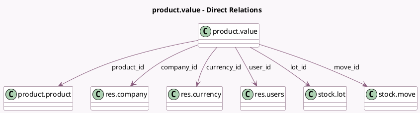

<!-- GENERATED:MODEL -->
---
tags: [odoo, community, generated, model]
---

# product.value

- Module: [[docs/Community Addons/stock_account/stock_account|stock_account]]
- Scope: Community Addons
- Defined in module: yes
- Source files: `models/product_value.py`
- Python classes: `ProductValue`
- Description: Product Value

## Field footprint

- Detected fields: 13
- Field types: `Char` x 2, `Datetime` x 1, `Many2one` x 6, `Monetary` x 2, `Text` x 2
- Relation fields: 6

## Sample fields

- `company_id`: `Many2one` (comodel `res.company`, compute `_compute_company_id`, store `True`)
- `computed_value_description`: `Text` (compute `_compute_value_description`)
- `currency_id`: `Many2one` (comodel `res.currency`, related `company_id.currency_id`)
- `current_value`: `Monetary` (related `move_id.value`)
- `current_value_description`: `Text` (compute `_compute_value_description`)
- `current_value_details`: `Char` (compute `_compute_current_value_details`)
- `date`: `Datetime`
- `description`: `Char`
- `lot_id`: `Many2one` (comodel `stock.lot`)
- `move_id`: `Many2one` (comodel `stock.move`)
- `product_id`: `Many2one` (comodel `product.product`)
- `user_id`: `Many2one` (comodel `res.users`)
- `value`: `Monetary`

## Method hints

- Detected methods: 4
- Action methods: none
- Compute methods: `_compute_company_id`, `_compute_current_value_details`, `_compute_value_description`
- Onchange methods: none

## Direct relation diagram

## Navigation

- **Parent:** [[docs/Community Addons/stock_account/Models]]

<!-- GENERATED:MODEL -->
