<!-- GENERATED:MODEL -->
---
tags: [odoo, community, generated, model]
---

# stock.avco.report

- Module: [[docs/Community Addons/stock_account/stock_account|stock_account]]
- Scope: Community Addons
- Defined in module: yes
- Source files: `report/stock_avco_audit_report.py`
- Python classes: `StockAverageCostReport`
- Description: Stock AVCO Justifier

## Field footprint

- Detected fields: 13
- Field types: `Char` x 1, `Date` x 1, `Float` x 6, `Many2one` x 3, `Selection` x 1, `Text` x 1
- Relation fields: 3

## Sample fields

- `added_value`: `Float` (compute `_compute_cumulative_fields`)
- `avco_value`: `Float` (compute `_compute_cumulative_fields`)
- `company_id`: `Many2one` (comodel `res.company`)
- `date`: `Date`
- `description`: `Text`
- `product_id`: `Many2one` (comodel `product.product`)
- `quantity`: `Float`
- `reference`: `Char`
- `res_model_name`: `Selection`
- `total_quantity`: `Float` (compute `_compute_cumulative_fields`)
- `total_value`: `Float` (compute `_compute_cumulative_fields`)
- `user_id`: `Many2one` (comodel `res.users`)
- `value`: `Float`

## Method hints

- Detected methods: 2
- Action methods: none
- Compute methods: `_compute_cumulative_fields`
- Onchange methods: none

## Direct relation diagram

```plantuml
@startuml
!define ODOO_COLOR_PRIMARY #714B67
!define ODOO_COLOR_ACCENT #875A7B
!define ODOO_COLOR_BG #FAF7FA

skinparam backgroundColor ODOO_COLOR_BG
skinparam defaultTextAlignment left
skinparam ArrowColor ODOO_COLOR_ACCENT
skinparam ClassBackgroundColor white
skinparam ClassBorderColor ODOO_COLOR_PRIMARY
skinparam ComponentBackgroundColor white
skinparam ComponentBorderColor ODOO_COLOR_PRIMARY
skinparam NoteBackgroundColor #FFF8FF
skinparam NoteBorderColor ODOO_COLOR_ACCENT
skinparam SequenceLifeLineBorderColor ODOO_COLOR_ACCENT
skinparam SequenceLifeLineBackgroundColor #FFFFFF
skinparam SequenceParticipantBorderColor ODOO_COLOR_PRIMARY
skinparam SequenceParticipantBackgroundColor #FFFFFF
skinparam sequence {
  ArrowColor ODOO_COLOR_ACCENT
  ActorBorderColor ODOO_COLOR_PRIMARY
}
title stock.avco.report - Direct Relations
class "stock.avco.report" as stock_avco_report
class "product.product" as product_product
class "res.company" as res_company
class "res.users" as res_users
stock_avco_report --> res_users : user_id
stock_avco_report --> res_company : company_id
stock_avco_report --> product_product : product_id
@enduml
```

## Navigation

- **Parent:** [[docs/Community Addons/stock_account/Models]]

<!-- GENERATED:MODEL -->
