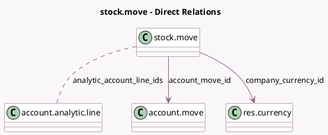

<!-- GENERATED:MODEL -->
---
tags: [odoo, community, generated, model]
---

# stock.move

- Module: [[docs/Community Addons/stock_account/stock_account|stock_account]]
- Scope: Community Addons
- Defined in module: extension only
- Source files: `models/stock_move.py`
- Python classes: `StockMove`

## Field footprint

- Detected fields: 14
- Field types: `Boolean` x 5, `Float` x 3, `Many2many` x 1, `Many2one` x 2, `Monetary` x 3
- Relation fields: 3

## Sample fields

- `account_move_id`: `Many2one` (comodel `account.move`)
- `analytic_account_line_ids`: `Many2many` (comodel `account.analytic.line`)
- `company_currency_id`: `Many2one` (comodel `res.currency`, related `company_id.currency_id`)
- `is_dropship`: `Boolean` (compute `_compute_is_dropship`, store `True`)
- `is_in`: `Boolean` (compute `_compute_is_in`, store `True`)
- `is_out`: `Boolean` (compute `_compute_is_out`, store `True`)
- `is_valued`: `Boolean` (compute `_compute_is_valued`)
- `price_unit`: `Float` (comodel `Price Unit`)
- `remaining_qty`: `Float` (compute `_compute_remaining_qty`)
- `remaining_value`: `Monetary` (compute `_compute_remaining_value`)
- `standard_price`: `Float` (related `product_id.standard_price`)
- `to_refund`: `Boolean` (comodel `Update quantities on SO/PO`)
- `value`: `Monetary` (comodel `Value`)
- `value_manual`: `Monetary` (comodel `Manual Value`, compute `_compute_value_manual`)

## Method hints

- Detected methods: 35
- Action methods: `action_adjust_valuation`
- Compute methods: `_compute_is_dropship`, `_compute_is_in`, `_compute_is_out`, `_compute_is_valued`, `_compute_remaining_qty`, `_compute_remaining_value`, `_compute_value_manual`
- Onchange methods: none

## Direct relation diagram

## Navigation

- **Parent:** [[docs/Community Addons/stock_account/Models]]

<!-- GENERATED:MODEL -->
