<!-- GENERATED:MODEL -->
---
tags: [odoo, community, generated, model]
---

# stock.quant

- Module: [[docs/Community Addons/stock_account/stock_account|stock_account]]
- Scope: Community Addons
- Defined in module: extension only
- Source files: `models/stock_quant.py`
- Python classes: `StockQuant`

## Field footprint

- Detected fields: 4
- Field types: `Date` x 1, `Many2one` x 1, `Monetary` x 1, `Selection` x 1
- Relation fields: 1

## Sample fields

- `accounting_date`: `Date` (comodel `Accounting Date`)
- `cost_method`: `Selection` (compute `_compute_cost_method`)
- `currency_id`: `Many2one` (comodel `res.currency`, related `company_id.currency_id`)
- `value`: `Monetary` (comodel `Value`, compute `_compute_value`)

## Method hints

- Detected methods: 8
- Action methods: none
- Compute methods: `_compute_cost_method`, `_compute_value`
- Onchange methods: none

## Direct relation diagram

```plantuml
@startuml
!define ODOO_COLOR_PRIMARY #714B67
!define ODOO_COLOR_ACCENT #875A7B
!define ODOO_COLOR_BG #FAF7FA

skinparam backgroundColor ODOO_COLOR_BG
skinparam defaultTextAlignment left
skinparam ArrowColor ODOO_COLOR_ACCENT
skinparam ClassBackgroundColor white
skinparam ClassBorderColor ODOO_COLOR_PRIMARY
skinparam ComponentBackgroundColor white
skinparam ComponentBorderColor ODOO_COLOR_PRIMARY
skinparam NoteBackgroundColor #FFF8FF
skinparam NoteBorderColor ODOO_COLOR_ACCENT
skinparam SequenceLifeLineBorderColor ODOO_COLOR_ACCENT
skinparam SequenceLifeLineBackgroundColor #FFFFFF
skinparam SequenceParticipantBorderColor ODOO_COLOR_PRIMARY
skinparam SequenceParticipantBackgroundColor #FFFFFF
skinparam sequence {
  ArrowColor ODOO_COLOR_ACCENT
  ActorBorderColor ODOO_COLOR_PRIMARY
}
title stock.quant - Direct Relations
class "stock.quant" as stock_quant
class "res.currency" as res_currency
stock_quant --> res_currency : currency_id
@enduml
```

## Navigation

- **Parent:** [[docs/Community Addons/stock_account/Models]]

<!-- GENERATED:MODEL -->
