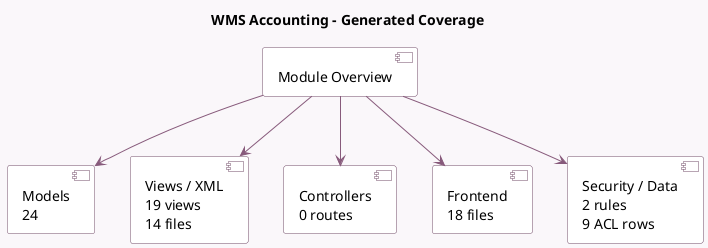

<!-- GENERATED:MODULE -->
---
tags: [odoo, community, module]
---

# WMS Accounting

- Scope: Community Addons
- Source: odoo/addons/stock_account
- Dependencies: [[docs/Community Addons/stock/stock|stock]], [[docs/Community Addons/account/account|account]]

## Summary

Inventory, Logistic, Valuation, Accounting

## Generated coverage

- Models: 24
- XML files with UI/data artifacts: 14
- Views: 19
- Actions: 5
- Menus: 0
- Rules (ir.rule): 2
- Access CSV entries: 9
- Controller units: 0
- Frontend asset files: 18

## Module map

## Detail notes

- Models: [[docs/Community Addons/stock_account/Models|Models]] (24)
- Views and XML: [[docs/Community Addons/stock_account/Views|Views]] (14 files)
- Frontend: [[docs/Community Addons/stock_account/Frontend|Frontend]] (18 files)

## Key models

- `account.account`
- `account.analytic.account`
- `account.analytic.plan`
- `account.chart.template`
- `account.move`
- `account.move.line`
- `product.category`
- `product.product`
- `product.template`
- `product.value`
- `res.company`
- `res.config.settings`

## Navigation

- [[../Community Addons/Community Addons|Back to scope]]
- [[../../docs/docs|Back to docs]]

<!-- GENERATED:MODULE -->

