<!-- GENERATED:MODEL -->
---
tags: [odoo, community, generated, model]
---

# stock.picking

- Module: [[docs/Community Addons/stock_delivery/stock_delivery|stock_delivery]]
- Scope: Community Addons
- Defined in module: extension only
- Source files: `models/stock_picking.py`
- Python classes: `StockPicking`

## Field footprint

- Detected fields: 12
- Field types: `Boolean` x 1, `Char` x 4, `Float` x 2, `Many2many` x 1, `Many2one` x 1, `One2many` x 1, `Selection` x 2
- Relation fields: 3

## Sample fields

- `allowed_carrier_ids`: `Many2many` (comodel `delivery.carrier`, compute `_compute_allowed_carrier_ids`)
- `carrier_id`: `Many2one` (comodel `delivery.carrier`)
- `carrier_price`: `Float`
- `carrier_tracking_ref`: `Char`
- `carrier_tracking_url`: `Char` (compute `_compute_carrier_tracking_url`)
- `delivery_type`: `Selection` (related `carrier_id.delivery_type`)
- `destination_country_code`: `Char` (related `partner_id.country_id.code`)
- `integration_level`: `Selection` (related `carrier_id.integration_level`)
- `is_return_picking`: `Boolean` (compute `_compute_return_picking`)
- `return_label_ids`: `One2many` (comodel `ir.attachment`, compute `_compute_return_label`)
- `weight`: `Float` (compute `_cal_weight`, store `True`)
- `weight_uom_name`: `Char` (compute `_compute_weight_uom_name`)

## Method hints

- Detected methods: 20
- Action methods: none
- Compute methods: `_compute_allowed_carrier_ids`, `_compute_carrier_tracking_url`, `_compute_return_label`, `_compute_return_picking`, `_compute_weight_uom_name`
- Onchange methods: none

## Direct relation diagram

```plantuml
@startuml
!define ODOO_COLOR_PRIMARY #714B67
!define ODOO_COLOR_ACCENT #875A7B
!define ODOO_COLOR_BG #FAF7FA

skinparam backgroundColor ODOO_COLOR_BG
skinparam defaultTextAlignment left
skinparam ArrowColor ODOO_COLOR_ACCENT
skinparam ClassBackgroundColor white
skinparam ClassBorderColor ODOO_COLOR_PRIMARY
skinparam ComponentBackgroundColor white
skinparam ComponentBorderColor ODOO_COLOR_PRIMARY
skinparam NoteBackgroundColor #FFF8FF
skinparam NoteBorderColor ODOO_COLOR_ACCENT
skinparam SequenceLifeLineBorderColor ODOO_COLOR_ACCENT
skinparam SequenceLifeLineBackgroundColor #FFFFFF
skinparam SequenceParticipantBorderColor ODOO_COLOR_PRIMARY
skinparam SequenceParticipantBackgroundColor #FFFFFF
skinparam sequence {
  ArrowColor ODOO_COLOR_ACCENT
  ActorBorderColor ODOO_COLOR_PRIMARY
}
title stock.picking - Direct Relations
class "stock.picking" as stock_picking
class "delivery.carrier" as delivery_carrier
class "ir.attachment" as ir_attachment
stock_picking .. delivery_carrier : allowed_carrier_ids
stock_picking --> delivery_carrier : carrier_id
stock_picking --|> ir_attachment : return_label_ids
@enduml
```

## Navigation

- **Parent:** [[docs/Community Addons/stock_delivery/Models]]

<!-- GENERATED:MODEL -->
