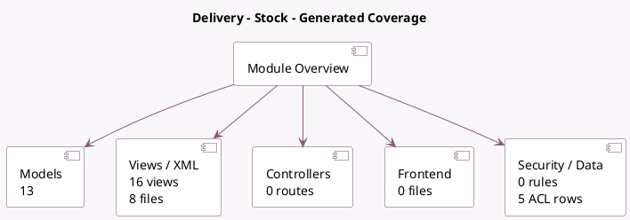

<!-- GENERATED:MODULE -->
---
tags: [odoo, community, module]
---

# Delivery - Stock

- Scope: Community Addons
- Source: odoo/addons/stock_delivery
- Dependencies: [[docs/Community Addons/sale_stock/sale_stock|sale_stock]], [[docs/Community Addons/delivery/delivery|delivery]]

## Generated coverage

- Models: 13
- XML files with UI/data artifacts: 8
- Views: 16
- Actions: 1
- Menus: 2
- Rules (ir.rule): 0
- Access CSV entries: 5
- Controller units: 0
- Frontend asset files: 0

## Module map

## Detail notes

- Models: [[docs/Community Addons/stock_delivery/Models|Models]] (13)
- Views and XML: [[docs/Community Addons/stock_delivery/Views|Views]] (8 files)

## Key models

- `choose.delivery.carrier`
- `delivery.carrier`
- `product.template`
- `sale.order`
- `sale.order.line`
- `stock.move`
- `stock.move.line`
- `stock.package`
- `stock.package.type`
- `stock.picking`
- `stock.put.in.pack`
- `stock.return.picking`

## Navigation

- [[../Community Addons/Community Addons|Back to scope]]
- [[../../docs/docs|Back to docs]]

<!-- GENERATED:MODULE -->

