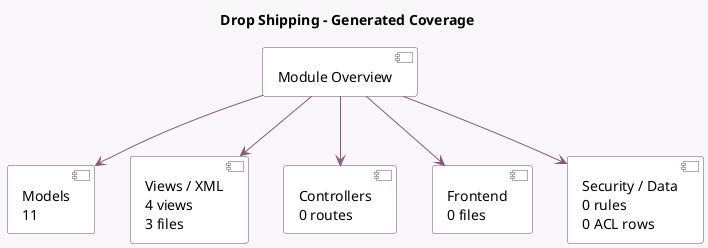

<!-- GENERATED:MODULE -->
---
tags: [odoo, community, module]
---

# Drop Shipping

- Scope: Community Addons
- Source: odoo/addons/stock_dropshipping
- Dependencies: [[docs/Community Addons/sale_purchase_stock/sale_purchase_stock|sale_purchase_stock]]

## Summary

Drop Shipping

## Generated coverage

- Models: 11
- XML files with UI/data artifacts: 3
- Views: 4
- Actions: 1
- Menus: 1
- Rules (ir.rule): 0
- Access CSV entries: 0
- Controller units: 0
- Frontend asset files: 0

## Module map

## Detail notes

- Models: [[docs/Community Addons/stock_dropshipping/Models|Models]] (11)
- Views and XML: [[docs/Community Addons/stock_dropshipping/Views|Views]] (3 files)

## Key models

- `product.product`
- `purchase.order`
- `res.company`
- `sale.order`
- `sale.order.line`
- `stock.lot`
- `stock.move`
- `stock.picking`
- `stock.picking.type`
- `stock.replenish.mixin`
- `stock.rule`

## Navigation

- [[../Community Addons/Community Addons|Back to scope]]
- [[../../docs/docs|Back to docs]]

<!-- GENERATED:MODULE -->

