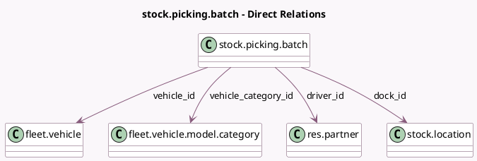

<!-- GENERATED:MODEL -->
---
tags: [odoo, community, generated, model]
---

# stock.picking.batch

- Module: [[docs/Community Addons/stock_fleet/stock_fleet|stock_fleet]]
- Scope: Community Addons
- Defined in module: extension only
- Source files: `models/stock_picking_batch.py`
- Python classes: `StockPickingBatch`

## Field footprint

- Detected fields: 13
- Field types: `Boolean` x 1, `Char` x 2, `Datetime` x 1, `Float` x 4, `Many2many` x 1, `Many2one` x 4
- Relation fields: 5

## Sample fields

- `allowed_dock_ids`: `Many2many` (related `picking_type_id.dock_ids`)
- `dock_id`: `Many2one` (comodel `stock.location`, compute `_compute_dock_id`, store `True`)
- `driver_id`: `Many2one` (comodel `res.partner`, compute `_compute_driver_id`, store `True`)
- `end_date`: `Datetime` (comodel `End Date`, compute `_compute_end_date`, store `True`)
- `has_dispatch_management`: `Boolean` (related `picking_type_id.dispatch_management`)
- `used_volume_percentage`: `Float` (compute `_compute_capacity_percentage`)
- `used_weight_percentage`: `Float` (compute `_compute_capacity_percentage`)
- `vehicle_category_id`: `Many2one` (comodel `fleet.vehicle.model.category`, compute `_compute_vehicle_category_id`, store `True`)
- `vehicle_id`: `Many2one` (comodel `fleet.vehicle`)
- `vehicle_volume_capacity`: `Float` (related `vehicle_category_id.volume_capacity`)
- `vehicle_weight_capacity`: `Float` (related `vehicle_category_id.weight_capacity`)
- `volume_uom_name`: `Char` (compute `_compute_volume_uom_name`)
- `weight_uom_name`: `Char` (compute `_compute_weight_uom_name`)

## Method hints

- Detected methods: 12
- Action methods: none
- Compute methods: `_compute_capacity_percentage`, `_compute_dock_id`, `_compute_driver_id`, `_compute_end_date`, `_compute_vehicle_category_id`, `_compute_volume_uom_name`, `_compute_weight_uom_name`
- Onchange methods: none

## Direct relation diagram

## Navigation

- **Parent:** [[docs/Community Addons/stock_fleet/Models]]

<!-- GENERATED:MODEL -->
