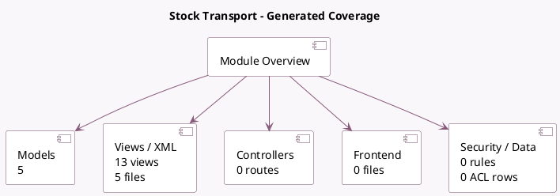

<!-- GENERATED:MODULE -->
---
tags: [odoo, community, module]
---

# Stock Transport

- Scope: Community Addons
- Source: odoo/addons/stock_fleet
- Dependencies: [[docs/Community Addons/stock_picking_batch/stock_picking_batch|stock_picking_batch]], [[docs/Community Addons/fleet/fleet|fleet]]

## Summary

Stock Transport: Dispatch Management System

## Generated coverage

- Models: 5
- XML files with UI/data artifacts: 5
- Views: 13
- Actions: 0
- Menus: 0
- Rules (ir.rule): 0
- Access CSV entries: 0
- Controller units: 0
- Frontend asset files: 0

## Module map

## Detail notes

- Models: [[docs/Community Addons/stock_fleet/Models|Models]] (5)
- Views and XML: [[docs/Community Addons/stock_fleet/Views|Views]] (5 files)

## Key models

- `fleet.vehicle.model.category`
- `stock.picking`
- `stock.picking.batch`
- `stock.picking.type`
- `stock.warehouse`

## Navigation

- [[../Community Addons/Community Addons|Back to scope]]
- [[../../docs/docs|Back to docs]]

<!-- GENERATED:MODULE -->

