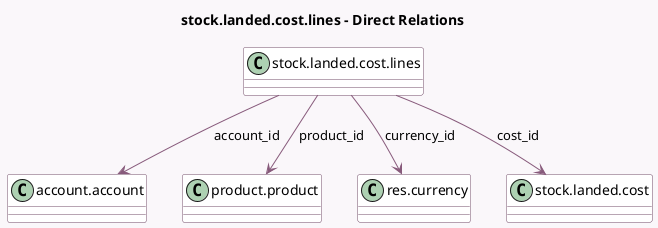

<!-- GENERATED:MODEL -->
---
tags: [odoo, community, generated, model]
---

# stock.landed.cost.lines

- Module: [[docs/Community Addons/stock_landed_costs/stock_landed_costs|stock_landed_costs]]
- Scope: Community Addons
- Defined in module: yes
- Source files: `models/stock_landed_cost.py`
- Python classes: `StockLandedCostLines`
- Description: Stock Landed Cost Line

## Field footprint

- Detected fields: 7
- Field types: `Char` x 1, `Many2one` x 4, `Monetary` x 1, `Selection` x 1
- Relation fields: 4

## Sample fields

- `account_id`: `Many2one` (comodel `account.account`)
- `cost_id`: `Many2one` (comodel `stock.landed.cost`)
- `currency_id`: `Many2one` (comodel `res.currency`, related `cost_id.currency_id`)
- `name`: `Char` (comodel `Description`)
- `price_unit`: `Monetary` (comodel `Cost`)
- `product_id`: `Many2one` (comodel `product.product`)
- `split_method`: `Selection`

## Method hints

- Detected methods: 1
- Action methods: none
- Compute methods: none
- Onchange methods: `onchange_product_id`

## Direct relation diagram

## Navigation

- **Parent:** [[docs/Community Addons/stock_landed_costs/Models]]

<!-- GENERATED:MODEL -->
