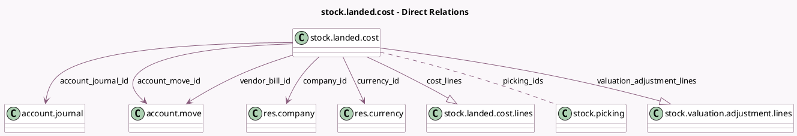

<!-- GENERATED:MODEL -->
---
tags: [odoo, community, generated, model]
---

# stock.landed.cost

- Module: [[docs/Community Addons/stock_landed_costs/stock_landed_costs|stock_landed_costs]]
- Scope: Community Addons
- Defined in module: yes
- Source files: `models/stock_landed_cost.py`
- Python classes: `StockLandedCost`
- Description: Stock Landed Cost
- Inherits: `mail.activity.mixin`, `mail.thread`

## Field footprint

- Detected fields: 14
- Field types: `Char` x 1, `Date` x 1, `Many2many` x 1, `Many2one` x 5, `Monetary` x 1, `One2many` x 2, `Selection` x 2, `Text` x 1
- Relation fields: 8

## Sample fields

- `account_journal_id`: `Many2one` (comodel `account.journal`)
- `account_move_id`: `Many2one` (comodel `account.move`)
- `amount_total`: `Monetary` (comodel `Total`, compute `_compute_total_amount`, store `True`)
- `company_id`: `Many2one` (comodel `res.company`)
- `cost_lines`: `One2many` (comodel `stock.landed.cost.lines`)
- `currency_id`: `Many2one` (comodel `res.currency`, related `company_id.currency_id`)
- `date`: `Date` (comodel `Date`)
- `description`: `Text` (comodel `Item Description`)
- `name`: `Char` (comodel `Name`)
- `picking_ids`: `Many2many` (comodel `stock.picking`)
- `state`: `Selection`
- `target_model`: `Selection`
- `valuation_adjustment_lines`: `One2many` (comodel `stock.valuation.adjustment.lines`)
- `vendor_bill_id`: `Many2one` (comodel `account.move`)

## Method hints

- Detected methods: 13
- Action methods: none
- Compute methods: `_compute_total_amount`
- Onchange methods: `_onchange_target_model`

## Direct relation diagram

## Navigation

- **Parent:** [[docs/Community Addons/stock_landed_costs/Models]]

<!-- GENERATED:MODEL -->
