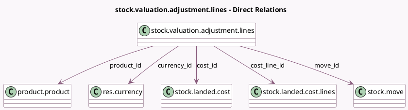

<!-- GENERATED:MODEL -->
---
tags: [odoo, community, generated, model]
---

# stock.valuation.adjustment.lines

- Module: [[docs/Community Addons/stock_landed_costs/stock_landed_costs|stock_landed_costs]]
- Scope: Community Addons
- Defined in module: yes
- Source files: `models/stock_landed_cost.py`
- Python classes: `StockValuationAdjustmentLines`
- Description: Valuation Adjustment Lines

## Field footprint

- Detected fields: 12
- Field types: `Char` x 1, `Float` x 3, `Many2one` x 5, `Monetary` x 3
- Relation fields: 5

## Sample fields

- `additional_landed_cost`: `Monetary` (comodel `Additional Landed Cost`)
- `cost_id`: `Many2one` (comodel `stock.landed.cost`)
- `cost_line_id`: `Many2one` (comodel `stock.landed.cost.lines`)
- `currency_id`: `Many2one` (comodel `res.currency`, related `cost_id.company_id.currency_id`)
- `final_cost`: `Monetary` (comodel `New Value`, compute `_compute_final_cost`, store `True`)
- `former_cost`: `Monetary` (comodel `Original Value`)
- `move_id`: `Many2one` (comodel `stock.move`)
- `name`: `Char` (comodel `Description`, compute `_compute_name`, store `True`)
- `product_id`: `Many2one` (comodel `product.product`)
- `quantity`: `Float` (comodel `Quantity`)
- `volume`: `Float` (comodel `Volume`)
- `weight`: `Float` (comodel `Weight`)

## Method hints

- Detected methods: 5
- Action methods: none
- Compute methods: `_compute_final_cost`, `_compute_name`
- Onchange methods: none

## Direct relation diagram

## Navigation

- **Parent:** [[docs/Community Addons/stock_landed_costs/Models]]

<!-- GENERATED:MODEL -->
