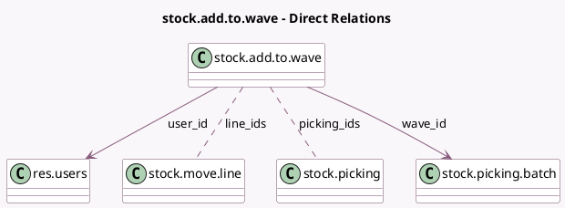

<!-- GENERATED:MODEL -->
---
tags: [odoo, community, generated, model]
---

# stock.add.to.wave

- Module: [[docs/Community Addons/stock_picking_batch/stock_picking_batch|stock_picking_batch]]
- Scope: Community Addons
- Defined in module: yes
- Source files: `wizard/stock_add_to_wave.py`
- Python classes: `StockAddToWave`
- Description: Wave Transfer Lines

## Field footprint

- Detected fields: 5
- Field types: `Many2many` x 2, `Many2one` x 2, `Selection` x 1
- Relation fields: 4

## Sample fields

- `line_ids`: `Many2many` (comodel `stock.move.line`)
- `mode`: `Selection`
- `picking_ids`: `Many2many` (comodel `stock.picking`)
- `user_id`: `Many2one` (comodel `res.users`)
- `wave_id`: `Many2one` (comodel `stock.picking.batch`)

## Method hints

- Detected methods: 2
- Action methods: none
- Compute methods: none
- Onchange methods: none

## Direct relation diagram

## Navigation

- **Parent:** [[docs/Community Addons/stock_picking_batch/Models]]

<!-- GENERATED:MODEL -->
