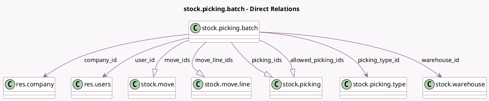

<!-- GENERATED:MODEL -->
---
tags: [odoo, community, generated, model]
---

# stock.picking.batch

- Module: [[docs/Community Addons/stock_picking_batch/stock_picking_batch|stock_picking_batch]]
- Scope: Community Addons
- Defined in module: yes
- Source files: `models/stock_picking_batch.py`
- Python classes: `StockPickingBatch`
- Description: Batch Transfer
- Inherits: `mail.activity.mixin`, `mail.thread`

## Field footprint

- Detected fields: 20
- Field types: `Boolean` x 4, `Char` x 2, `Datetime` x 1, `Float` x 2, `Many2one` x 4, `One2many` x 4, `Properties` x 1, `Selection` x 2
- Relation fields: 8

## Sample fields

- `allowed_picking_ids`: `One2many` (comodel `stock.picking`, compute `_compute_allowed_picking_ids`)
- `company_id`: `Many2one` (comodel `res.company`)
- `description`: `Char` (comodel `Description`)
- `estimated_shipping_volume`: `Float` (comodel `shipping_volume`, compute `_compute_estimated_shipping_capacity`)
- `estimated_shipping_weight`: `Float` (comodel `shipping_weight`, compute `_compute_estimated_shipping_capacity`)
- `is_wave`: `Boolean` (comodel `This batch is a wave`)
- `move_ids`: `One2many` (comodel `stock.move`, compute `_compute_move_ids`)
- `move_line_ids`: `One2many` (comodel `stock.move.line`, compute `_compute_move_line_ids`)
- `name`: `Char`
- `picking_ids`: `One2many` (comodel `stock.picking`)
- `picking_type_code`: `Selection` (related `picking_type_id.code`)
- `picking_type_id`: `Many2one` (comodel `stock.picking.type`)
- `properties`: `Properties` (comodel `Properties`)
- `scheduled_date`: `Datetime` (comodel `Scheduled Date`, compute `_compute_scheduled_date`, store `True`)
- `show_allocation`: `Boolean` (compute `_compute_show_allocation`)
- `show_check_availability`: `Boolean` (compute `_compute_move_ids`)
- `show_lots_text`: `Boolean` (compute `_compute_show_lots_text`)
- `state`: `Selection` (compute `_compute_state`, store `True`)
- `user_id`: `Many2one` (comodel `res.users`)
- `warehouse_id`: `Many2one` (comodel `stock.warehouse`, related `picking_type_id.warehouse_id`)

## Method hints

- Detected methods: 34
- Action methods: `action_assign`, `action_batch_detailed_operations`, `action_cancel`, `action_confirm`, `action_done`, `action_merge`, `action_open_label_layout`, `action_print`, and 3 more
- Compute methods: `_compute_allowed_picking_ids`, `_compute_display_name`, `_compute_estimated_shipping_capacity`, `_compute_move_ids`, `_compute_move_line_ids`, `_compute_scheduled_date`, `_compute_show_allocation`, `_compute_show_lots_text`, and 1 more
- Onchange methods: `onchange_scheduled_date`

## Direct relation diagram

## Navigation

- **Parent:** [[docs/Community Addons/stock_picking_batch/Models]]

<!-- GENERATED:MODEL -->
