<!-- GENERATED:MODEL -->
---
tags: [odoo, community, generated, model]
---

# stock.picking.to.batch

- Module: [[docs/Community Addons/stock_picking_batch/stock_picking_batch|stock_picking_batch]]
- Scope: Community Addons
- Defined in module: yes
- Source files: `wizard/stock_picking_to_batch.py`
- Python classes: `StockPickingToBatch`
- Description: Batch Transfer Lines

## Field footprint

- Detected fields: 5
- Field types: `Boolean` x 1, `Char` x 1, `Many2one` x 2, `Selection` x 1
- Relation fields: 2

## Sample fields

- `batch_id`: `Many2one` (comodel `stock.picking.batch`)
- `description`: `Char` (comodel `Description`)
- `is_create_draft`: `Boolean`
- `mode`: `Selection`
- `user_id`: `Many2one` (comodel `res.users`)

## Method hints

- Detected methods: 1
- Action methods: none
- Compute methods: none
- Onchange methods: none

## Direct relation diagram

```plantuml
@startuml
!define ODOO_COLOR_PRIMARY #714B67
!define ODOO_COLOR_ACCENT #875A7B
!define ODOO_COLOR_BG #FAF7FA

skinparam backgroundColor ODOO_COLOR_BG
skinparam defaultTextAlignment left
skinparam ArrowColor ODOO_COLOR_ACCENT
skinparam ClassBackgroundColor white
skinparam ClassBorderColor ODOO_COLOR_PRIMARY
skinparam ComponentBackgroundColor white
skinparam ComponentBorderColor ODOO_COLOR_PRIMARY
skinparam NoteBackgroundColor #FFF8FF
skinparam NoteBorderColor ODOO_COLOR_ACCENT
skinparam SequenceLifeLineBorderColor ODOO_COLOR_ACCENT
skinparam SequenceLifeLineBackgroundColor #FFFFFF
skinparam SequenceParticipantBorderColor ODOO_COLOR_PRIMARY
skinparam SequenceParticipantBackgroundColor #FFFFFF
skinparam sequence {
  ArrowColor ODOO_COLOR_ACCENT
  ActorBorderColor ODOO_COLOR_PRIMARY
}
title stock.picking.to.batch - Direct Relations
class "stock.picking.to.batch" as stock_picking_to_batch
class "res.users" as res_users
class "stock.picking.batch" as stock_picking_batch
stock_picking_to_batch --> stock_picking_batch : batch_id
stock_picking_to_batch --> res_users : user_id
@enduml
```

## Navigation

- **Parent:** [[docs/Community Addons/stock_picking_batch/Models]]

<!-- GENERATED:MODEL -->
