<!-- GENERATED:MODEL -->
---
tags: [odoo, community, generated, model]
---

# stock.picking.type

- Module: [[docs/Community Addons/stock_picking_batch/stock_picking_batch|stock_picking_batch]]
- Scope: Community Addons
- Defined in module: extension only
- Source files: `models/stock_picking.py`
- Python classes: `StockPickingType`

## Field footprint

- Detected fields: 16
- Field types: `Boolean` x 9, `Integer` x 4, `Many2many` x 2, `PropertiesDefinition` x 1
- Relation fields: 2

## Sample fields

- `auto_batch`: `Boolean` (comodel `Automatic Batches`)
- `batch_auto_confirm`: `Boolean` (comodel `Auto-confirm`)
- `batch_group_by_dest_loc`: `Boolean` (comodel `Group by Destination Location`)
- `batch_group_by_destination`: `Boolean` (comodel `Destination Country`)
- `batch_group_by_partner`: `Boolean` (comodel `Contact`)
- `batch_group_by_src_loc`: `Boolean` (comodel `Group by Source Location`)
- `batch_max_lines`: `Integer` (comodel `Maximum lines`)
- `batch_max_pickings`: `Integer` (comodel `Maximum transfers`)
- `batch_properties_definition`: `PropertiesDefinition` (comodel `Batch Properties`)
- `count_picking_batch`: `Integer` (compute `_compute_picking_count`)
- `count_picking_wave`: `Integer` (compute `_compute_picking_count`)
- `wave_category_ids`: `Many2many` (comodel `product.category`)
- `wave_group_by_category`: `Boolean` (comodel `Product Category`)
- `wave_group_by_location`: `Boolean` (comodel `Location`)
- `wave_group_by_product`: `Boolean` (comodel `Product`)
- `wave_location_ids`: `Many2many` (comodel `stock.location`)

## Method hints

- Detected methods: 9
- Action methods: `action_batch`, `action_wave`
- Compute methods: `_compute_picking_count`
- Onchange methods: none

## Direct relation diagram

```plantuml
@startuml
!define ODOO_COLOR_PRIMARY #714B67
!define ODOO_COLOR_ACCENT #875A7B
!define ODOO_COLOR_BG #FAF7FA

skinparam backgroundColor ODOO_COLOR_BG
skinparam defaultTextAlignment left
skinparam ArrowColor ODOO_COLOR_ACCENT
skinparam ClassBackgroundColor white
skinparam ClassBorderColor ODOO_COLOR_PRIMARY
skinparam ComponentBackgroundColor white
skinparam ComponentBorderColor ODOO_COLOR_PRIMARY
skinparam NoteBackgroundColor #FFF8FF
skinparam NoteBorderColor ODOO_COLOR_ACCENT
skinparam SequenceLifeLineBorderColor ODOO_COLOR_ACCENT
skinparam SequenceLifeLineBackgroundColor #FFFFFF
skinparam SequenceParticipantBorderColor ODOO_COLOR_PRIMARY
skinparam SequenceParticipantBackgroundColor #FFFFFF
skinparam sequence {
  ArrowColor ODOO_COLOR_ACCENT
  ActorBorderColor ODOO_COLOR_PRIMARY
}
title stock.picking.type - Direct Relations
class "stock.picking.type" as stock_picking_type
class "product.category" as product_category
class "stock.location" as stock_location
stock_picking_type .. product_category : wave_category_ids
stock_picking_type .. stock_location : wave_location_ids
@enduml
```

## Navigation

- **Parent:** [[docs/Community Addons/stock_picking_batch/Models]]

<!-- GENERATED:MODEL -->
