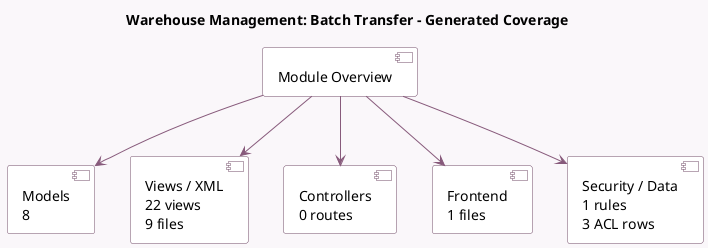

<!-- GENERATED:MODULE -->
---
tags: [odoo, community, module]
---

# Warehouse Management: Batch Transfer

- Scope: Community Addons
- Source: odoo/addons/stock_picking_batch
- Dependencies: [[docs/Community Addons/stock/stock|stock]]

## Generated coverage

- Models: 8
- XML files with UI/data artifacts: 9
- Views: 22
- Actions: 9
- Menus: 3
- Rules (ir.rule): 1
- Access CSV entries: 3
- Controller units: 0
- Frontend asset files: 1

## Module map

## Detail notes

- Models: [[docs/Community Addons/stock_picking_batch/Models|Models]] (8)
- Views and XML: [[docs/Community Addons/stock_picking_batch/Views|Views]] (9 files)
- Frontend: [[docs/Community Addons/stock_picking_batch/Frontend|Frontend]] (1 files)

## Key models

- `stock.add.to.wave`
- `stock.move`
- `stock.move.line`
- `stock.picking`
- `stock.picking.batch`
- `stock.picking.to.batch`
- `stock.picking.type`
- `stock.warehouse`

## Navigation

- [[../Community Addons/Community Addons|Back to scope]]
- [[../../docs/docs|Back to docs]]

<!-- GENERATED:MODULE -->

