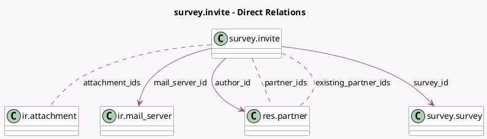

<!-- GENERATED:MODEL -->
---
tags: [odoo, community, generated, model]
---

# survey.invite

- Module: [[docs/Community Addons/survey/survey|survey]]
- Scope: Community Addons
- Defined in module: yes
- Source files: `wizard/survey_invite.py`
- Python classes: `SurveyInvite`
- Description: Survey Invitation Wizard
- Inherits: `mail.composer.mixin`

## Field footprint

- Detected fields: 16
- Field types: `Boolean` x 3, `Char` x 1, `Datetime` x 1, `Many2many` x 3, `Many2one` x 3, `Selection` x 2, `Text` x 3
- Relation fields: 6

## Sample fields

- `attachment_ids`: `Many2many` (comodel `ir.attachment`, compute `_compute_attachment_ids`, store `True`)
- `author_id`: `Many2one` (comodel `res.partner`)
- `deadline`: `Datetime`
- `emails`: `Text`
- `existing_emails`: `Text` (comodel `Existing emails`, compute `_compute_existing_emails`, store `False`)
- `existing_mode`: `Selection`
- `existing_partner_ids`: `Many2many` (comodel `res.partner`, compute `_compute_existing_partner_ids`, store `False`)
- `existing_text`: `Text` (comodel `Resend Comment`, compute `_compute_existing_text`)
- `mail_server_id`: `Many2one` (comodel `ir.mail_server`)
- `partner_ids`: `Many2many` (comodel `res.partner`)
- `send_email`: `Boolean` (compute `_compute_send_email`)
- `survey_access_mode`: `Selection` (related `survey_id.access_mode`)
- `survey_id`: `Many2one` (comodel `survey.survey`)
- `survey_start_url`: `Char` (comodel `Survey URL`, compute `_compute_survey_start_url`)
- `survey_users_can_signup`: `Boolean` (related `survey_id.users_can_signup`)
- `survey_users_login_required`: `Boolean` (related `survey_id.users_login_required`)

## Method hints

- Detected methods: 19
- Action methods: `action_invite`
- Compute methods: `_compute_attachment_ids`, `_compute_body`, `_compute_existing_emails`, `_compute_existing_partner_ids`, `_compute_existing_text`, `_compute_render_model`, `_compute_send_email`, `_compute_subject`, and 1 more
- Onchange methods: `_onchange_emails`, `_onchange_partner_ids`

## Direct relation diagram

## Navigation

- **Parent:** [[docs/Community Addons/survey/Models]]

<!-- GENERATED:MODEL -->
