<!-- GENERATED:MODEL -->
---
tags: [odoo, community, generated, model]
---

# survey.question.answer

- Module: [[docs/Community Addons/survey/survey|survey]]
- Scope: Community Addons
- Defined in module: yes
- Source files: `models/survey_question.py`
- Python classes: `SurveyQuestionAnswer`
- Description: Survey Label

## Field footprint

- Detected fields: 11
- Field types: `Boolean` x 1, `Char` x 3, `Float` x 1, `Image` x 1, `Integer` x 1, `Many2one` x 2, `Selection` x 2
- Relation fields: 2

## Sample fields

- `answer_score`: `Float` (comodel `Score`)
- `is_correct`: `Boolean` (comodel `Correct`)
- `matrix_question_id`: `Many2one` (comodel `survey.question`)
- `question_id`: `Many2one` (comodel `survey.question`)
- `question_type`: `Selection` (related `question_id.question_type`)
- `scoring_type`: `Selection` (related `question_id.scoring_type`)
- `sequence`: `Integer` (comodel `Label Sequence order`)
- `value`: `Char` (comodel `Suggested value`)
- `value_image`: `Image` (comodel `Image`)
- `value_image_filename`: `Char` (comodel `Image Filename`)
- `value_label`: `Char` (comodel `Value Label`, compute `_compute_value_label`)

## Method hints

- Detected methods: 4
- Action methods: none
- Compute methods: `_compute_display_name`, `_compute_value_label`
- Onchange methods: none

## Direct relation diagram

```plantuml
@startuml
!define ODOO_COLOR_PRIMARY #714B67
!define ODOO_COLOR_ACCENT #875A7B
!define ODOO_COLOR_BG #FAF7FA

skinparam backgroundColor ODOO_COLOR_BG
skinparam defaultTextAlignment left
skinparam ArrowColor ODOO_COLOR_ACCENT
skinparam ClassBackgroundColor white
skinparam ClassBorderColor ODOO_COLOR_PRIMARY
skinparam ComponentBackgroundColor white
skinparam ComponentBorderColor ODOO_COLOR_PRIMARY
skinparam NoteBackgroundColor #FFF8FF
skinparam NoteBorderColor ODOO_COLOR_ACCENT
skinparam SequenceLifeLineBorderColor ODOO_COLOR_ACCENT
skinparam SequenceLifeLineBackgroundColor #FFFFFF
skinparam SequenceParticipantBorderColor ODOO_COLOR_PRIMARY
skinparam SequenceParticipantBackgroundColor #FFFFFF
skinparam sequence {
  ArrowColor ODOO_COLOR_ACCENT
  ActorBorderColor ODOO_COLOR_PRIMARY
}
title survey.question.answer - Direct Relations
class "survey.question.answer" as survey_question_answer
class "survey.question" as survey_question
survey_question_answer --> survey_question : question_id
survey_question_answer --> survey_question : matrix_question_id
@enduml
```

## Navigation

- **Parent:** [[docs/Community Addons/survey/Models]]

<!-- GENERATED:MODEL -->
