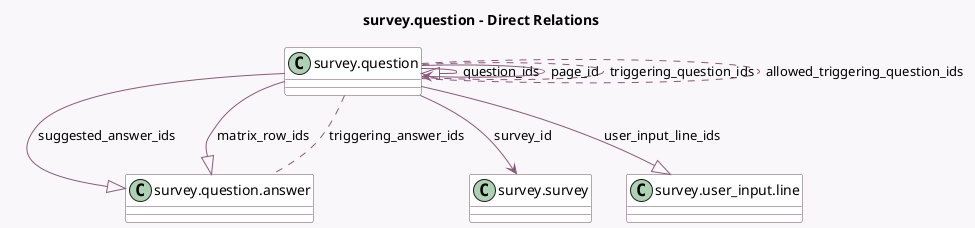

<!-- GENERATED:MODEL -->
---
tags: [odoo, community, generated, model]
---

# survey.question

- Module: [[docs/Community Addons/survey/survey|survey]]
- Scope: Community Addons
- Defined in module: yes
- Source files: `models/survey_question.py`
- Python classes: `SurveyQuestion`
- Description: Survey Question

## Field footprint

- Detected fields: 57
- Field types: `Boolean` x 15, `Char` x 9, `Date` x 3, `Datetime` x 3, `Float` x 4, `Html` x 1, `Image` x 1, `Integer` x 8, `Many2many` x 3, `Many2one` x 2, `One2many` x 4, `Selection` x 4
- Relation fields: 9

## Sample fields

- `allowed_triggering_question_ids`: `Many2many` (comodel `survey.question`, compute `_compute_allowed_triggering_question_ids`)
- `answer_date`: `Date` (comodel `Correct date answer`)
- `answer_datetime`: `Datetime` (comodel `Correct datetime answer`)
- `answer_numerical_box`: `Float` (comodel `Correct numerical answer`)
- `answer_score`: `Float` (comodel `Score`)
- `background_image`: `Image` (comodel `Background Image`, compute `_compute_background_image`, store `True`)
- `background_image_url`: `Char` (comodel `Background Url`, compute `_compute_background_image_url`)
- `comment_count_as_answer`: `Boolean` (comodel `Comment is an answer`)
- `comments_allowed`: `Boolean` (comodel `Show Comments Field`)
- `comments_message`: `Char` (comodel `Comment Message`)
- `constr_error_msg`: `Char` (comodel `Error message`)
- `constr_mandatory`: `Boolean` (comodel `Mandatory Answer`)
- `description`: `Html` (comodel `Description`)
- `has_image_only_suggested_answer`: `Boolean` (comodel `Has image only suggested answer`, compute `_compute_has_image_only_suggested_answer`)
- `is_page`: `Boolean` (comodel `Is a page?`)
- `is_placed_before_trigger`: `Boolean` (compute `_compute_allowed_triggering_question_ids`)
- `is_scored_question`: `Boolean` (comodel `Scored`, compute `_compute_is_scored_question`, store `True`)
- `is_time_customized`: `Boolean` (comodel `Customized speed rewards`)
- `is_time_limited`: `Boolean` (comodel `The question is limited in time`)
- `matrix_row_ids`: `One2many` (comodel `survey.question.answer`)

## Method hints

- Detected methods: 38
- Action methods: none
- Compute methods: `_compute_allowed_triggering_question_ids`, `_compute_background_image`, `_compute_background_image_url`, `_compute_has_image_only_suggested_answer`, `_compute_is_scored_question`, `_compute_page_id`, `_compute_question_ids`, `_compute_question_placeholder`, and 5 more
- Onchange methods: `_onchange_validation_parameters`

## Direct relation diagram

## Navigation

- **Parent:** [[docs/Community Addons/survey/Models]]

<!-- GENERATED:MODEL -->
