<!-- GENERATED:MODEL -->
---
tags: [odoo, community, generated, model]
---

# survey.survey

- Module: [[docs/Community Addons/survey/survey|survey]]
- Scope: Community Addons
- Defined in module: yes
- Source files: `models/survey_survey.py`, `models/templates/survey_survey.py`
- Python classes: `SurveySurvey`
- Description: Survey
- Inherits: `mail.activity.mixin`, `mail.thread`

## Field footprint

- Detected fields: 57
- Field types: `Boolean` x 12, `Char` x 5, `Datetime` x 2, `Float` x 5, `Html` x 2, `Image` x 1, `Integer` x 10, `Json` x 1, `Many2many` x 2, `Many2one` x 5, `One2many` x 4, `Selection` x 8
- Relation fields: 11

## Sample fields

- `access_mode`: `Selection`
- `access_token`: `Char` (comodel `Access Token`)
- `active`: `Boolean` (comodel `Active`)
- `allowed_survey_types`: `Json` (compute `_compute_allowed_survey_types`)
- `answer_count`: `Integer` (comodel `Registered`, compute `_compute_survey_statistic`)
- `answer_done_count`: `Integer` (comodel `Attempts`, compute `_compute_survey_statistic`)
- `answer_duration_avg`: `Float` (comodel `Average Duration`, compute `_compute_answer_duration_avg`)
- `answer_score_avg`: `Float` (comodel `Avg Score (%)`, compute `_compute_survey_statistic`)
- `attempts_limit`: `Integer` (comodel `Number of attempts`)
- `background_image`: `Image` (comodel `Background Image`)
- `background_image_url`: `Char` (comodel `Background Url`, compute `_compute_background_image_url`)
- `certification`: `Boolean` (comodel `Is a Certification`, compute `_compute_certification`, store `True`)
- `certification_badge_id`: `Many2one` (comodel `gamification.badge`)
- `certification_badge_id_dummy`: `Many2one` (related `certification_badge_id`)
- `certification_give_badge`: `Boolean` (comodel `Give Badge`, compute `_compute_certification_give_badge`, store `True`)
- `certification_mail_template_id`: `Many2one` (comodel `mail.template`)
- `certification_report_layout`: `Selection`
- `color`: `Integer` (comodel `Color Index`)
- `description`: `Html` (comodel `Description`)
- `description_done`: `Html` (comodel `End Message`)

## Method hints

- Detected methods: 78
- Action methods: `action_archive`, `action_end_session`, `action_load_sample_custom`, `action_load_survey_template_sample`, `action_open_session_manager`, `action_print_survey`, `action_result_survey`, `action_send_survey`, and 9 more
- Compute methods: `_compute_allowed_survey_types`, `_compute_answer_duration_avg`, `_compute_background_image_url`, `_compute_certification`, `_compute_certification_give_badge`, `_compute_has_conditional_questions`, `_compute_is_attempts_limited`, `_compute_page_and_question_ids`, and 10 more
- Onchange methods: `_onchange_restrict_user_ids`, `_onchange_session_speed_rating`, `_onchange_survey_type`

## Direct relation diagram

```plantuml
@startuml
!define ODOO_COLOR_PRIMARY #714B67
!define ODOO_COLOR_ACCENT #875A7B
!define ODOO_COLOR_BG #FAF7FA

skinparam backgroundColor ODOO_COLOR_BG
skinparam defaultTextAlignment left
skinparam ArrowColor ODOO_COLOR_ACCENT
skinparam ClassBackgroundColor white
skinparam ClassBorderColor ODOO_COLOR_PRIMARY
skinparam ComponentBackgroundColor white
skinparam ComponentBorderColor ODOO_COLOR_PRIMARY
skinparam NoteBackgroundColor #FFF8FF
skinparam NoteBorderColor ODOO_COLOR_ACCENT
skinparam SequenceLifeLineBorderColor ODOO_COLOR_ACCENT
skinparam SequenceLifeLineBackgroundColor #FFFFFF
skinparam SequenceParticipantBorderColor ODOO_COLOR_PRIMARY
skinparam SequenceParticipantBackgroundColor #FFFFFF
skinparam sequence {
  ArrowColor ODOO_COLOR_ACCENT
  ActorBorderColor ODOO_COLOR_PRIMARY
}
title survey.survey - Direct Relations
class "survey.survey" as survey_survey
class "gamification.badge" as gamification_badge
class "mail.template" as mail_template
class "res.lang" as res_lang
class "res.users" as res_users
class "survey.question" as survey_question
class "survey.user_input" as survey_user_input
survey_survey .. res_lang : lang_ids
survey_survey --> res_users : user_id
survey_survey .. res_users : restrict_user_ids
survey_survey --|> survey_question : question_and_page_ids
survey_survey --|> survey_question : page_ids
survey_survey --|> survey_question : question_ids
survey_survey --|> survey_user_input : user_input_ids
survey_survey --> mail_template : certification_mail_template_id
survey_survey --> gamification_badge : certification_badge_id
survey_survey --> survey_question : session_question_id
@enduml
```

## Navigation

- **Parent:** [[docs/Community Addons/survey/Models]]

<!-- GENERATED:MODEL -->
