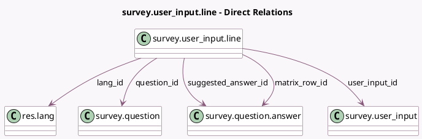

<!-- GENERATED:MODEL -->
---
tags: [odoo, community, generated, model]
---

# survey.user_input.line

- Module: [[docs/Community Addons/survey/survey|survey]]
- Scope: Community Addons
- Defined in module: yes
- Source files: `models/survey_user_input.py`
- Python classes: `SurveyUser_InputLine`
- Description: Survey User Input Line

## Field footprint

- Detected fields: 18
- Field types: `Boolean` x 2, `Char` x 1, `Date` x 1, `Datetime` x 1, `Float` x 2, `Integer` x 2, `Many2one` x 7, `Selection` x 1, `Text` x 1
- Relation fields: 7

## Sample fields

- `answer_is_correct`: `Boolean` (comodel `Correct`, compute `_compute_answer_score`, store `True`)
- `answer_score`: `Float` (comodel `Score`, compute `_compute_answer_score`, store `True`)
- `answer_type`: `Selection`
- `lang_id`: `Many2one` (comodel `res.lang`, related `user_input_id.lang_id`)
- `matrix_row_id`: `Many2one` (comodel `survey.question.answer`)
- `page_id`: `Many2one` (related `question_id.page_id`)
- `question_id`: `Many2one` (comodel `survey.question`)
- `question_sequence`: `Integer` (comodel `Sequence`, related `question_id.sequence`, store `True`)
- `skipped`: `Boolean` (comodel `Skipped`)
- `suggested_answer_id`: `Many2one` (comodel `survey.question.answer`)
- `survey_id`: `Many2one` (related `user_input_id.survey_id`, store `True`)
- `user_input_id`: `Many2one` (comodel `survey.user_input`)
- `value_char_box`: `Char` (comodel `Text answer`)
- `value_date`: `Date` (comodel `Date answer`)
- `value_datetime`: `Datetime` (comodel `Datetime answer`)
- `value_numerical_box`: `Float` (comodel `Numerical answer`)
- `value_scale`: `Integer` (comodel `Scale value`)
- `value_text_box`: `Text` (comodel `Free Text answer`)

## Method hints

- Detected methods: 5
- Action methods: none
- Compute methods: `_compute_answer_score`, `_compute_display_name`
- Onchange methods: none

## Direct relation diagram

## Navigation

- **Parent:** [[docs/Community Addons/survey/Models]]

<!-- GENERATED:MODEL -->
