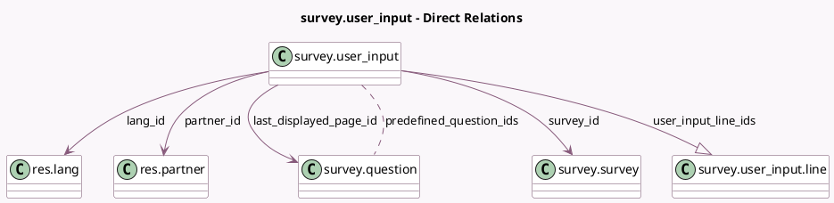

<!-- GENERATED:MODEL -->
---
tags: [odoo, community, generated, model]
---

# survey.user_input

- Module: [[docs/Community Addons/survey/survey|survey]]
- Scope: Community Addons
- Defined in module: yes
- Source files: `models/survey_user_input.py`
- Python classes: `SurveyUser_Input`
- Description: Survey User Input
- Inherits: `mail.activity.mixin`, `mail.thread`

## Field footprint

- Detected fields: 27
- Field types: `Boolean` x 7, `Char` x 4, `Datetime` x 3, `Float` x 2, `Integer` x 3, `Many2many` x 1, `Many2one` x 4, `One2many` x 1, `Selection` x 2
- Relation fields: 6

## Sample fields

- `access_token`: `Char` (comodel `Identification token`)
- `attempts_count`: `Integer` (comodel `Attempts Count`, compute `_compute_attempts_info`)
- `attempts_limit`: `Integer` (comodel `Number of attempts`, related `survey_id.attempts_limit`)
- `attempts_number`: `Integer` (comodel `Attempt n°`, compute `_compute_attempts_info`)
- `deadline`: `Datetime` (comodel `Deadline`)
- `email`: `Char` (comodel `Email`)
- `end_datetime`: `Datetime` (comodel `End date and time`)
- `invite_token`: `Char` (comodel `Invite token`)
- `is_attempts_limited`: `Boolean` (comodel `Limited number of attempts`, related `survey_id.is_attempts_limited`)
- `is_session_answer`: `Boolean` (comodel `Is in a Session`)
- `lang_id`: `Many2one` (comodel `res.lang`)
- `last_displayed_page_id`: `Many2one` (comodel `survey.question`)
- `nickname`: `Char` (comodel `Nickname`)
- `partner_id`: `Many2one` (comodel `res.partner`)
- `predefined_question_ids`: `Many2many` (comodel `survey.question`)
- `question_time_limit_reached`: `Boolean` (comodel `Question Time Limit Reached`, compute `_compute_question_time_limit_reached`)
- `scoring_percentage`: `Float` (comodel `Score (%)`, compute `_compute_scoring_values`, store `True`)
- `scoring_success`: `Boolean` (comodel `Quiz Passed`, compute `_compute_scoring_success`, store `True`)
- `scoring_total`: `Float` (comodel `Total Score`, compute `_compute_scoring_values`, store `True`)
- `scoring_type`: `Selection` (related `survey_id.scoring_type`)

## Method hints

- Detected methods: 33
- Action methods: `action_print_answers`, `action_redirect_to_attempts`, `action_resend`
- Compute methods: `_compute_attempts_info`, `_compute_question_time_limit_reached`, `_compute_scoring_success`, `_compute_scoring_values`, `_compute_survey_time_limit_reached`
- Onchange methods: none

## Direct relation diagram

## Navigation

- **Parent:** [[docs/Community Addons/survey/Models]]

<!-- GENERATED:MODEL -->
