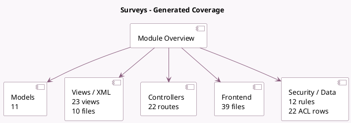

<!-- GENERATED:MODULE -->
---
tags: [odoo, community, module]
---

# Surveys

- Scope: Community Addons
- Source: odoo/addons/survey
- Dependencies: [[docs/Community Addons/auth_signup/auth_signup|auth_signup]], [[docs/Community Addons/http_routing/http_routing|http_routing]], [[docs/Community Addons/mail/mail|mail]], [[docs/Community Addons/web_tour/web_tour|web_tour]], [[docs/Community Addons/gamification/gamification|gamification]]

## Summary

Send your surveys or share them live.

## Generated coverage

- Models: 11
- XML files with UI/data artifacts: 10
- Views: 23
- Actions: 8
- Menus: 7
- Rules (ir.rule): 12
- Access CSV entries: 22
- Controller units: 2
- Frontend asset files: 39

## Module map

## Detail notes

- Models: [[docs/Community Addons/survey/Models|Models]] (11)
- Views and XML: [[docs/Community Addons/survey/Views|Views]] (10 files)
- Controllers: [[docs/Community Addons/survey/Controllers|Controllers]] (2)
- Frontend: [[docs/Community Addons/survey/Frontend|Frontend]] (39 files)

## Key models

- `gamification.badge`
- `gamification.challenge`
- `ir.http`
- `res.lang`
- `res.partner`
- `survey.invite`
- `survey.question`
- `survey.question.answer`
- `survey.survey`
- `survey.user_input`
- `survey.user_input.line`

## Navigation

- [[../Community Addons/Community Addons|Back to scope]]
- [[../../docs/docs|Back to docs]]

<!-- GENERATED:MODULE -->

