<!-- GENERATED:MODEL -->
---
tags: [odoo, community, generated, model]
---

# survey.survey

- Module: [[docs/Community Addons/survey_crm/survey_crm|survey_crm]]
- Scope: Community Addons
- Defined in module: extension only
- Source files: `models/survey_survey.py`, `models/templates/survey_survey.py`
- Python classes: `SurveySurvey`

## Field footprint

- Detected fields: 4
- Field types: `Boolean` x 1, `Integer` x 1, `Many2one` x 1, `One2many` x 1
- Relation fields: 2

## Sample fields

- `generate_lead`: `Boolean` (comodel `Lead Generating`, compute `_compute_generate_lead`)
- `lead_count`: `Integer` (comodel `Leads`, compute `_compute_lead_count`)
- `lead_ids`: `One2many` (comodel `crm.lead`)
- `team_id`: `Many2one` (comodel `crm.team`)

## Method hints

- Detected methods: 7
- Action methods: `action_end_session`, `action_survey_see_leads`
- Compute methods: `_compute_generate_lead`, `_compute_lead_count`
- Onchange methods: none

## Direct relation diagram

```plantuml
@startuml
!define ODOO_COLOR_PRIMARY #714B67
!define ODOO_COLOR_ACCENT #875A7B
!define ODOO_COLOR_BG #FAF7FA

skinparam backgroundColor ODOO_COLOR_BG
skinparam defaultTextAlignment left
skinparam ArrowColor ODOO_COLOR_ACCENT
skinparam ClassBackgroundColor white
skinparam ClassBorderColor ODOO_COLOR_PRIMARY
skinparam ComponentBackgroundColor white
skinparam ComponentBorderColor ODOO_COLOR_PRIMARY
skinparam NoteBackgroundColor #FFF8FF
skinparam NoteBorderColor ODOO_COLOR_ACCENT
skinparam SequenceLifeLineBorderColor ODOO_COLOR_ACCENT
skinparam SequenceLifeLineBackgroundColor #FFFFFF
skinparam SequenceParticipantBorderColor ODOO_COLOR_PRIMARY
skinparam SequenceParticipantBackgroundColor #FFFFFF
skinparam sequence {
  ArrowColor ODOO_COLOR_ACCENT
  ActorBorderColor ODOO_COLOR_PRIMARY
}
title survey.survey - Direct Relations
class "survey.survey" as survey_survey
class "crm.lead" as crm_lead
class "crm.team" as crm_team
survey_survey --|> crm_lead : lead_ids
survey_survey --> crm_team : team_id
@enduml
```

## Navigation

- **Parent:** [[docs/Community Addons/survey_crm/Models]]

<!-- GENERATED:MODEL -->
