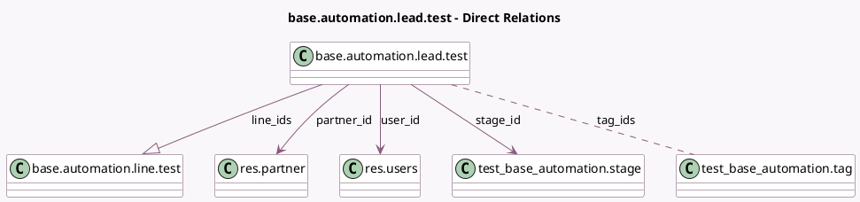

<!-- GENERATED:MODEL -->
---
tags: [odoo, community, generated, model]
---

# base.automation.lead.test

- Module: [[docs/Community Addons/test_base_automation/test_base_automation|test_base_automation]]
- Scope: Community Addons
- Defined in module: yes
- Source files: `models/test_base_automation.py`
- Python classes: `BaseAutomationLeadTest`
- Description: Automated Rule Test

## Field footprint

- Detected fields: 13
- Field types: `Boolean` x 5, `Char` x 1, `Datetime` x 1, `Many2many` x 1, `Many2one` x 3, `One2many` x 1, `Selection` x 1
- Relation fields: 5

## Sample fields

- `active`: `Boolean`
- `date_automation_last`: `Datetime`
- `deadline`: `Boolean` (compute `_compute_employee_deadline`, store `True`)
- `employee`: `Boolean` (compute `_compute_employee_deadline`, store `True`)
- `is_assigned_to_admin`: `Boolean`
- `line_ids`: `One2many` (comodel `base.automation.line.test`)
- `name`: `Char`
- `partner_id`: `Many2one` (comodel `res.partner`)
- `priority`: `Boolean`
- `stage_id`: `Many2one` (comodel `test_base_automation.stage`, compute `_compute_stage_id`, store `True`)
- `state`: `Selection`
- `tag_ids`: `Many2many` (comodel `test_base_automation.tag`)
- `user_id`: `Many2one` (comodel `res.users`)

## Method hints

- Detected methods: 3
- Action methods: none
- Compute methods: `_compute_employee_deadline`, `_compute_stage_id`
- Onchange methods: none

## Direct relation diagram

## Navigation

- **Parent:** [[docs/Community Addons/test_base_automation/Models]]

<!-- GENERATED:MODEL -->
