<!-- GENERATED:MODEL -->
---
tags: [odoo, community, generated, model]
---

# base.automation.lead.thread.test

- Module: [[docs/Community Addons/test_base_automation/test_base_automation|test_base_automation]]
- Scope: Community Addons
- Defined in module: yes
- Source files: `models/test_base_automation.py`
- Python classes: `BaseAutomationLeadThreadTest`
- Description: Automated Rule Test With Thread
- Inherits: `base.automation.lead.test`, `mail.thread`

## Field footprint

- Detected fields: 1
- Field types: `Many2one` x 1
- Relation fields: 1

## Sample fields

- `user_id`: `Many2one` (comodel `res.users`)

## Method hints

- Detected methods: 0
- Action methods: none
- Compute methods: none
- Onchange methods: none

## Direct relation diagram

```plantuml
@startuml
!define ODOO_COLOR_PRIMARY #714B67
!define ODOO_COLOR_ACCENT #875A7B
!define ODOO_COLOR_BG #FAF7FA

skinparam backgroundColor ODOO_COLOR_BG
skinparam defaultTextAlignment left
skinparam ArrowColor ODOO_COLOR_ACCENT
skinparam ClassBackgroundColor white
skinparam ClassBorderColor ODOO_COLOR_PRIMARY
skinparam ComponentBackgroundColor white
skinparam ComponentBorderColor ODOO_COLOR_PRIMARY
skinparam NoteBackgroundColor #FFF8FF
skinparam NoteBorderColor ODOO_COLOR_ACCENT
skinparam SequenceLifeLineBorderColor ODOO_COLOR_ACCENT
skinparam SequenceLifeLineBackgroundColor #FFFFFF
skinparam SequenceParticipantBorderColor ODOO_COLOR_PRIMARY
skinparam SequenceParticipantBackgroundColor #FFFFFF
skinparam sequence {
  ArrowColor ODOO_COLOR_ACCENT
  ActorBorderColor ODOO_COLOR_PRIMARY
}
title base.automation.lead.thread.test - Direct Relations
class "base.automation.lead.thread.test" as base_automation_lead_thread_test
class "res.users" as res_users
base_automation_lead_thread_test --> res_users : user_id
@enduml
```

## Navigation

- **Parent:** [[docs/Community Addons/test_base_automation/Models]]

<!-- GENERATED:MODEL -->
