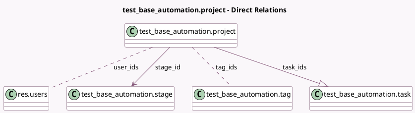

<!-- GENERATED:MODEL -->
---
tags: [odoo, community, generated, model]
---

# test_base_automation.project

- Module: [[docs/Community Addons/test_base_automation/test_base_automation|test_base_automation]]
- Scope: Community Addons
- Defined in module: yes
- Source files: `models/test_base_automation.py`
- Python classes: `Test_Base_AutomationProject`
- Description: test_base_automation.project

## Field footprint

- Detected fields: 6
- Field types: `Char` x 1, `Many2many` x 2, `Many2one` x 1, `One2many` x 1, `Selection` x 1
- Relation fields: 4

## Sample fields

- `name`: `Char`
- `priority`: `Selection`
- `stage_id`: `Many2one` (comodel `test_base_automation.stage`)
- `tag_ids`: `Many2many` (comodel `test_base_automation.tag`)
- `task_ids`: `One2many` (comodel `test_base_automation.task`)
- `user_ids`: `Many2many` (comodel `res.users`)

## Method hints

- Detected methods: 0
- Action methods: none
- Compute methods: none
- Onchange methods: none

## Direct relation diagram

## Navigation

- **Parent:** [[docs/Community Addons/test_base_automation/Models]]

<!-- GENERATED:MODEL -->
