<!-- GENERATED:MODEL -->
---
tags: [odoo, community, generated, model]
---

# test_base_automation.task

- Module: [[docs/Community Addons/test_base_automation/test_base_automation|test_base_automation]]
- Scope: Community Addons
- Defined in module: yes
- Source files: `models/test_base_automation.py`
- Python classes: `Test_Base_AutomationTask`
- Description: test_base_automation.task

## Field footprint

- Detected fields: 3
- Field types: `Char` x 1, `Many2one` x 2
- Relation fields: 2

## Sample fields

- `name`: `Char`
- `parent_id`: `Many2one` (comodel `test_base_automation.task`)
- `project_id`: `Many2one` (comodel `test_base_automation.project`, compute `_compute_project_id`, store `True`)

## Method hints

- Detected methods: 1
- Action methods: none
- Compute methods: `_compute_project_id`
- Onchange methods: none

## Direct relation diagram

```plantuml
@startuml
!define ODOO_COLOR_PRIMARY #714B67
!define ODOO_COLOR_ACCENT #875A7B
!define ODOO_COLOR_BG #FAF7FA

skinparam backgroundColor ODOO_COLOR_BG
skinparam defaultTextAlignment left
skinparam ArrowColor ODOO_COLOR_ACCENT
skinparam ClassBackgroundColor white
skinparam ClassBorderColor ODOO_COLOR_PRIMARY
skinparam ComponentBackgroundColor white
skinparam ComponentBorderColor ODOO_COLOR_PRIMARY
skinparam NoteBackgroundColor #FFF8FF
skinparam NoteBorderColor ODOO_COLOR_ACCENT
skinparam SequenceLifeLineBorderColor ODOO_COLOR_ACCENT
skinparam SequenceLifeLineBackgroundColor #FFFFFF
skinparam SequenceParticipantBorderColor ODOO_COLOR_PRIMARY
skinparam SequenceParticipantBackgroundColor #FFFFFF
skinparam sequence {
  ArrowColor ODOO_COLOR_ACCENT
  ActorBorderColor ODOO_COLOR_PRIMARY
}
title test_base_automation.task - Direct Relations
class "test_base_automation.task" as test_base_automation_task
class "test_base_automation.project" as test_base_automation_project
class "test_base_automation.task" as test_base_automation_task
test_base_automation_task --> test_base_automation_task : parent_id
test_base_automation_task --> test_base_automation_project : project_id
@enduml
```

## Navigation

- **Parent:** [[docs/Community Addons/test_base_automation/Models]]

<!-- GENERATED:MODEL -->
