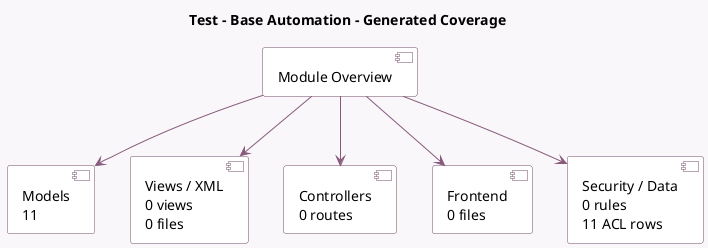

<!-- GENERATED:MODULE -->
---
tags: [odoo, community, module]
---

# Test - Base Automation

- Scope: Community Addons
- Source: odoo/addons/test_base_automation
- Dependencies: [[docs/Community Addons/base_automation/base_automation|base_automation]]

## Summary

Base Automation Tests: Ensure Flow Robustness

## Generated coverage

- Models: 11
- XML files with UI/data artifacts: 0
- Views: 0
- Actions: 0
- Menus: 0
- Rules (ir.rule): 0
- Access CSV entries: 11
- Controller units: 0
- Frontend asset files: 0

## Module map

## Detail notes

- Models: [[docs/Community Addons/test_base_automation/Models|Models]] (11)

## Key models

- `base.automation.lead.test`
- `base.automation.lead.thread.test`
- `base.automation.line.test`
- `base.automation.link.test`
- `base.automation.linked.test`
- `base.automation.model.with.recname.char`
- `base.automation.model.with.recname.m2o`
- `test_base_automation.project`
- `test_base_automation.stage`
- `test_base_automation.tag`
- `test_base_automation.task`

## Navigation

- [[../Community Addons/Community Addons|Back to scope]]
- [[../../docs/docs|Back to docs]]

<!-- GENERATED:MODULE -->

