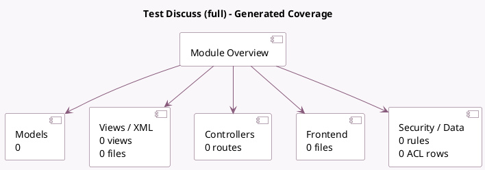

<!-- GENERATED:MODULE -->
---
tags: [odoo, community, module]
---

# Test Discuss (full)

- Scope: Community Addons
- Source: odoo/addons/test_discuss_full
- Dependencies: [[docs/Community Addons/calendar/calendar|calendar]], [[docs/Community Addons/crm/crm|crm]], [[docs/Community Addons/crm_livechat/crm_livechat|crm_livechat]], [[docs/Community Addons/hr_attendance/hr_attendance|hr_attendance]], [[docs/Community Addons/hr_fleet/hr_fleet|hr_fleet]], [[docs/Community Addons/hr_holidays/hr_holidays|hr_holidays]], [[docs/Community Addons/hr_homeworking/hr_homeworking|hr_homeworking]], [[docs/Community Addons/im_livechat/im_livechat|im_livechat]], [[docs/Community Addons/mail/mail|mail]], [[docs/Community Addons/mail_bot/mail_bot|mail_bot]], [[docs/Community Addons/project_todo/project_todo|project_todo]], [[docs/Community Addons/website_livechat/website_livechat|website_livechat]], [[docs/Community Addons/website_sale/website_sale|website_sale]], [[docs/Community Addons/website_slides/website_slides|website_slides]]

## Summary

Test of Discuss with all possible overrides installed.

## Generated coverage

- Models: 0
- XML files with UI/data artifacts: 0
- Views: 0
- Actions: 0
- Menus: 0
- Rules (ir.rule): 0
- Access CSV entries: 0
- Controller units: 0
- Frontend asset files: 0

## Module map

## Navigation

- [[../Community Addons/Community Addons|Back to scope]]
- [[../../docs/docs|Back to docs]]

<!-- GENERATED:MODULE -->

