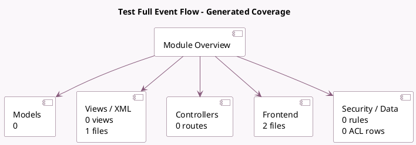

<!-- GENERATED:MODULE -->
---
tags: [odoo, community, module]
---

# Test Full Event Flow

- Scope: Community Addons
- Source: odoo/addons/test_event_full
- Dependencies: [[docs/Community Addons/event/event|event]], [[docs/Community Addons/event_booth/event_booth|event_booth]], [[docs/Community Addons/event_crm/event_crm|event_crm]], [[docs/Community Addons/event_crm_sale/event_crm_sale|event_crm_sale]], [[docs/Community Addons/event_sale/event_sale|event_sale]], [[docs/Community Addons/event_sms/event_sms|event_sms]], [[docs/Community Addons/payment_demo/payment_demo|payment_demo]], [[docs/Community Addons/website_event_booth_sale_exhibitor/website_event_booth_sale_exhibitor|website_event_booth_sale_exhibitor]], [[docs/Community Addons/website_event_exhibitor/website_event_exhibitor|website_event_exhibitor]], [[docs/Community Addons/website_event_sale/website_event_sale|website_event_sale]], [[docs/Community Addons/website_event_track/website_event_track|website_event_track]], [[docs/Community Addons/website_event_track_live/website_event_track_live|website_event_track_live]], [[docs/Community Addons/website_event_track_quiz/website_event_track_quiz|website_event_track_quiz]]

## Generated coverage

- Models: 0
- XML files with UI/data artifacts: 1
- Views: 0
- Actions: 1
- Menus: 0
- Rules (ir.rule): 0
- Access CSV entries: 0
- Controller units: 0
- Frontend asset files: 2

## Module map

## Detail notes

- Views and XML: [[docs/Community Addons/test_event_full/Views|Views]] (1 files)
- Frontend: [[docs/Community Addons/test_event_full/Frontend|Frontend]] (2 files)

## Navigation

- [[../Community Addons/Community Addons|Back to scope]]
- [[../../docs/docs|Back to docs]]

<!-- GENERATED:MODULE -->

