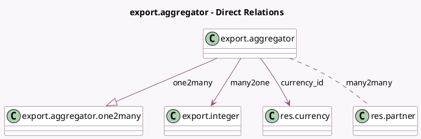

<!-- GENERATED:MODEL -->
---
tags: [odoo, community, generated, model]
---

# export.aggregator

- Module: [[docs/Community Addons/test_import_export/test_import_export|test_import_export]]
- Scope: Community Addons
- Defined in module: yes
- Source files: `models/models_export.py`
- Python classes: `ExportAggregator`
- Description: Export Aggregator

## Field footprint

- Detected fields: 13
- Field types: `Boolean` x 3, `Date` x 1, `Float` x 2, `Integer` x 2, `Many2many` x 1, `Many2one` x 2, `Monetary` x 1, `One2many` x 1
- Relation fields: 4

## Sample fields

- `active`: `Boolean`
- `bool_and`: `Boolean`
- `bool_or`: `Boolean`
- `currency_id`: `Many2one` (comodel `res.currency`)
- `date_max`: `Date`
- `float_avg`: `Float`
- `float_min`: `Float`
- `float_monetary`: `Monetary`
- `int_max`: `Integer`
- `int_sum`: `Integer`
- `many2many`: `Many2many` (comodel `res.partner`)
- `many2one`: `Many2one` (comodel `export.integer`)
- `one2many`: `One2many` (comodel `export.aggregator.one2many`)

## Method hints

- Detected methods: 0
- Action methods: none
- Compute methods: none
- Onchange methods: none

## Direct relation diagram

## Navigation

- **Parent:** [[docs/Community Addons/test_import_export/Models]]

<!-- GENERATED:MODEL -->
