<!-- GENERATED:MODEL -->
---
tags: [odoo, community, generated, model]
---

# export.aggregator.one2many

- Module: [[docs/Community Addons/test_import_export/test_import_export|test_import_export]]
- Scope: Community Addons
- Defined in module: yes
- Source files: `models/models_export.py`
- Python classes: `ExportAggregatorOne2many`
- Description: Export Aggregator One2Many

## Field footprint

- Detected fields: 4
- Field types: `Boolean` x 1, `Char` x 1, `Integer` x 1, `Many2one` x 1
- Relation fields: 1

## Sample fields

- `active`: `Boolean`
- `name`: `Char`
- `parent_id`: `Many2one` (comodel `export.aggregator`)
- `value`: `Integer`

## Method hints

- Detected methods: 0
- Action methods: none
- Compute methods: none
- Onchange methods: none

## Direct relation diagram

```plantuml
@startuml
!define ODOO_COLOR_PRIMARY #714B67
!define ODOO_COLOR_ACCENT #875A7B
!define ODOO_COLOR_BG #FAF7FA

skinparam backgroundColor ODOO_COLOR_BG
skinparam defaultTextAlignment left
skinparam ArrowColor ODOO_COLOR_ACCENT
skinparam ClassBackgroundColor white
skinparam ClassBorderColor ODOO_COLOR_PRIMARY
skinparam ComponentBackgroundColor white
skinparam ComponentBorderColor ODOO_COLOR_PRIMARY
skinparam NoteBackgroundColor #FFF8FF
skinparam NoteBorderColor ODOO_COLOR_ACCENT
skinparam SequenceLifeLineBorderColor ODOO_COLOR_ACCENT
skinparam SequenceLifeLineBackgroundColor #FFFFFF
skinparam SequenceParticipantBorderColor ODOO_COLOR_PRIMARY
skinparam SequenceParticipantBackgroundColor #FFFFFF
skinparam sequence {
  ArrowColor ODOO_COLOR_ACCENT
  ActorBorderColor ODOO_COLOR_PRIMARY
}
title export.aggregator.one2many - Direct Relations
class "export.aggregator.one2many" as export_aggregator_one2many
class "export.aggregator" as export_aggregator
export_aggregator_one2many --> export_aggregator : parent_id
@enduml
```

## Navigation

- **Parent:** [[docs/Community Addons/test_import_export/Models]]

<!-- GENERATED:MODEL -->
