<!-- GENERATED:MODEL -->
---
tags: [odoo, community, generated, model]
---

# export.one2many.child

- Module: [[docs/Community Addons/test_import_export/test_import_export|test_import_export]]
- Scope: Community Addons
- Defined in module: yes
- Source files: `models/models_export_impex.py`
- Python classes: `ExportOne2manyChild`
- Description: Export One to Many Child

## Field footprint

- Detected fields: 4
- Field types: `Char` x 1, `Integer` x 1, `Many2one` x 2
- Relation fields: 2

## Sample fields

- `m2o`: `Many2one` (comodel `export.integer`)
- `parent_id`: `Many2one` (comodel `export.one2many`)
- `str`: `Char`
- `value`: `Integer`

## Method hints

- Detected methods: 0
- Action methods: none
- Compute methods: none
- Onchange methods: none

## Direct relation diagram

```plantuml
@startuml
!define ODOO_COLOR_PRIMARY #714B67
!define ODOO_COLOR_ACCENT #875A7B
!define ODOO_COLOR_BG #FAF7FA

skinparam backgroundColor ODOO_COLOR_BG
skinparam defaultTextAlignment left
skinparam ArrowColor ODOO_COLOR_ACCENT
skinparam ClassBackgroundColor white
skinparam ClassBorderColor ODOO_COLOR_PRIMARY
skinparam ComponentBackgroundColor white
skinparam ComponentBorderColor ODOO_COLOR_PRIMARY
skinparam NoteBackgroundColor #FFF8FF
skinparam NoteBorderColor ODOO_COLOR_ACCENT
skinparam SequenceLifeLineBorderColor ODOO_COLOR_ACCENT
skinparam SequenceLifeLineBackgroundColor #FFFFFF
skinparam SequenceParticipantBorderColor ODOO_COLOR_PRIMARY
skinparam SequenceParticipantBackgroundColor #FFFFFF
skinparam sequence {
  ArrowColor ODOO_COLOR_ACCENT
  ActorBorderColor ODOO_COLOR_PRIMARY
}
title export.one2many.child - Direct Relations
class "export.one2many.child" as export_one2many_child
class "export.integer" as export_integer
class "export.one2many" as export_one2many
export_one2many_child --> export_one2many : parent_id
export_one2many_child --> export_integer : m2o
@enduml
```

## Navigation

- **Parent:** [[docs/Community Addons/test_import_export/Models]]

<!-- GENERATED:MODEL -->
