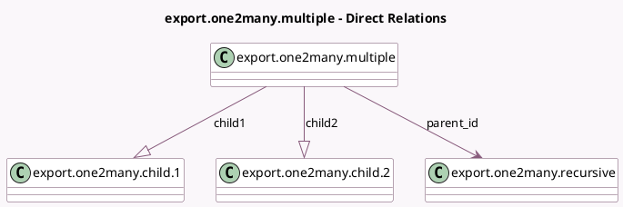

<!-- GENERATED:MODEL -->
---
tags: [odoo, community, generated, model]
---

# export.one2many.multiple

- Module: [[docs/Community Addons/test_import_export/test_import_export|test_import_export]]
- Scope: Community Addons
- Defined in module: yes
- Source files: `models/models_export_impex.py`
- Python classes: `ExportOne2manyMultiple`
- Description: Export One To Many Multiple

## Field footprint

- Detected fields: 4
- Field types: `Integer` x 1, `Many2one` x 1, `One2many` x 2
- Relation fields: 3

## Sample fields

- `child1`: `One2many` (comodel `export.one2many.child.1`)
- `child2`: `One2many` (comodel `export.one2many.child.2`)
- `const`: `Integer`
- `parent_id`: `Many2one` (comodel `export.one2many.recursive`)

## Method hints

- Detected methods: 0
- Action methods: none
- Compute methods: none
- Onchange methods: none

## Direct relation diagram

## Navigation

- **Parent:** [[docs/Community Addons/test_import_export/Models]]

<!-- GENERATED:MODEL -->
