<!-- GENERATED:MODEL -->
---
tags: [odoo, community, generated, model]
---

# mail.test.field.type

- Module: [[docs/Community Addons/test_mail/test_mail|test_mail]]
- Scope: Community Addons
- Defined in module: yes
- Source files: `models/test_mail_corner_case_models.py`
- Python classes: `MailTestFieldType`
- Description: Test Field Type
- Inherits: `mail.thread`

## Field footprint

- Detected fields: 6
- Field types: `Char` x 2, `Datetime` x 1, `Many2one` x 2, `Selection` x 1
- Relation fields: 2

## Sample fields

- `customer_id`: `Many2one` (comodel `res.partner`)
- `datetime`: `Datetime`
- `email_from`: `Char`
- `name`: `Char`
- `type`: `Selection`
- `user_id`: `Many2one` (comodel `res.users`)

## Method hints

- Detected methods: 2
- Action methods: none
- Compute methods: none
- Onchange methods: none

## Direct relation diagram

```plantuml
@startuml
!define ODOO_COLOR_PRIMARY #714B67
!define ODOO_COLOR_ACCENT #875A7B
!define ODOO_COLOR_BG #FAF7FA

skinparam backgroundColor ODOO_COLOR_BG
skinparam defaultTextAlignment left
skinparam ArrowColor ODOO_COLOR_ACCENT
skinparam ClassBackgroundColor white
skinparam ClassBorderColor ODOO_COLOR_PRIMARY
skinparam ComponentBackgroundColor white
skinparam ComponentBorderColor ODOO_COLOR_PRIMARY
skinparam NoteBackgroundColor #FFF8FF
skinparam NoteBorderColor ODOO_COLOR_ACCENT
skinparam SequenceLifeLineBorderColor ODOO_COLOR_ACCENT
skinparam SequenceLifeLineBackgroundColor #FFFFFF
skinparam SequenceParticipantBorderColor ODOO_COLOR_PRIMARY
skinparam SequenceParticipantBackgroundColor #FFFFFF
skinparam sequence {
  ArrowColor ODOO_COLOR_ACCENT
  ActorBorderColor ODOO_COLOR_PRIMARY
}
title mail.test.field.type - Direct Relations
class "mail.test.field.type" as mail_test_field_type
class "res.partner" as res_partner
class "res.users" as res_users
mail_test_field_type --> res_partner : customer_id
mail_test_field_type --> res_users : user_id
@enduml
```

## Navigation

- **Parent:** [[docs/Community Addons/test_mail/Models]]

<!-- GENERATED:MODEL -->
