<!-- GENERATED:MODEL -->
---
tags: [odoo, community, generated, model]
---

# mail.test.rotting.resource

- Module: [[docs/Community Addons/test_mail/test_mail|test_mail]]
- Scope: Community Addons
- Defined in module: yes
- Source files: `models/test_mail_feature_models.py`
- Python classes: `MailTestRottingMixin`
- Description: Fake model to test the rotting part of the mixin mail.thread.tracking.duration.mixin
- Inherits: `mail.tracking.duration.mixin`

## Field footprint

- Detected fields: 4
- Field types: `Boolean` x 1, `Char` x 1, `Datetime` x 1, `Many2one` x 1
- Relation fields: 1

## Sample fields

- `date_last_stage_update`: `Datetime` (comodel `Last Stage Update`, compute `_compute_date_last_stage_update`, store `True`)
- `done`: `Boolean`
- `name`: `Char`
- `stage_id`: `Many2one` (comodel `mail.test.rotting.stage`)

## Method hints

- Detected methods: 3
- Action methods: none
- Compute methods: `_compute_date_last_stage_update`
- Onchange methods: none

## Direct relation diagram

```plantuml
@startuml
!define ODOO_COLOR_PRIMARY #714B67
!define ODOO_COLOR_ACCENT #875A7B
!define ODOO_COLOR_BG #FAF7FA

skinparam backgroundColor ODOO_COLOR_BG
skinparam defaultTextAlignment left
skinparam ArrowColor ODOO_COLOR_ACCENT
skinparam ClassBackgroundColor white
skinparam ClassBorderColor ODOO_COLOR_PRIMARY
skinparam ComponentBackgroundColor white
skinparam ComponentBorderColor ODOO_COLOR_PRIMARY
skinparam NoteBackgroundColor #FFF8FF
skinparam NoteBorderColor ODOO_COLOR_ACCENT
skinparam SequenceLifeLineBorderColor ODOO_COLOR_ACCENT
skinparam SequenceLifeLineBackgroundColor #FFFFFF
skinparam SequenceParticipantBorderColor ODOO_COLOR_PRIMARY
skinparam SequenceParticipantBackgroundColor #FFFFFF
skinparam sequence {
  ArrowColor ODOO_COLOR_ACCENT
  ActorBorderColor ODOO_COLOR_PRIMARY
}
title mail.test.rotting.resource - Direct Relations
class "mail.test.rotting.resource" as mail_test_rotting_resource
class "mail.test.rotting.stage" as mail_test_rotting_stage
mail_test_rotting_resource --> mail_test_rotting_stage : stage_id
@enduml
```

## Navigation

- **Parent:** [[docs/Community Addons/test_mail/Models]]

<!-- GENERATED:MODEL -->
